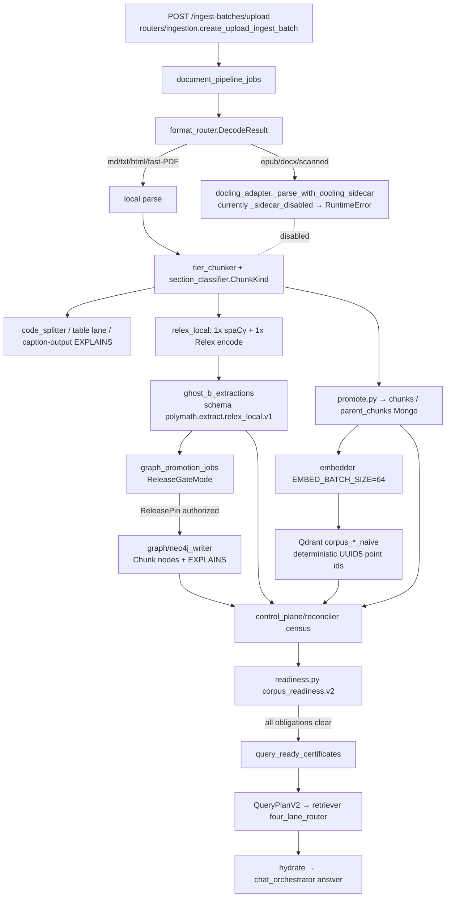
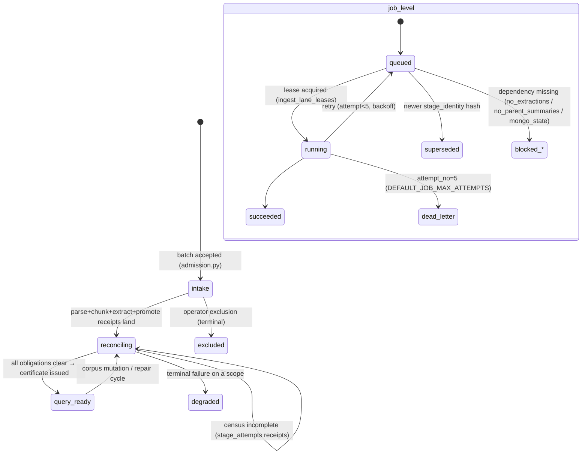

# Polymath Book-Ingestion Control-Plane Audit — 2026-08-03

Audit class: repository-grounded, read-only first pass. No production code was
modified. All live figures come from `data_eval/book_ingestion_pipeline_probe.json`
and `data_eval/book_ingestion_pressure_baseline.json`, produced by
`backend/scripts/probe_book_ingestion_pipeline.py` and
`backend/scripts/benchmark_book_ingestion_pressure.py` against the running stack
(Mongo :27017, Qdrant :6333, Neo4j :7687, backend :8000, ingest-worker container).

Unmeasured quantities are marked **MEASURE_REQUIRED**. No percentages are used as
release metrics; the final section gives categorical verdicts only.

---

## 0. Executive verdict (see §10 for citations)

| verdict | state |
|---|---|
| arbitrary_book_ingestion | **partial** |
| mixed_content_routing | **passed** |
| relex_only_extraction | **partial** |
| chunk_summary_generation | **failed** |
| parent_section_summary_generation | **failed** |
| document_summary_generation | **failed** |
| promotion_idempotency | **passed** |
| route_aware_readiness | **partial** |
| restart_recoverability | **passed** |
| one_thousand_file_admission_control | **partial** |
| one_thousand_file_backpressure | **partial** |
| one_thousand_file_recovery | **partial** |
| production_ready | **failed** |

The single root cause behind the three `failed` summary verdicts and the blocked
`query_ready` path is **GAP-01**: provider-backed summary generation requires a
`summary_cost_run_id` that no current ingest profile supplies, so the repair cycle
fails closed (`SummaryCostAuthorityRequired`, observed at attempt_no=31 on fixture
corpus `f842e3b5`) and the readiness census never clears its `summary_ids`
obligation. Everything upstream of summaries (parse → chunk → Relex extraction →
Qdrant/Neo4j promotion → retrieval) is live-verified working.

---

## 1. Part 1 — End-to-end trace of one book

### 1.1 Intake surface

| intake | entry point | lane |
|---|---|---|
| upload (≤25 files) | `backend/routers/ingestion.py` `create_upload_ingest_batch` (`POST /api/corpora/{cid}/ingest-batches/upload`) | durable batch → `document_pipeline_jobs` |
| mounted folder | `POST /api/corpora/{cid}/ingest-source` (jailed mount) | durable folder batch |
| profiles | `mac_safe`, `mac_queryable_first`, `rtx_assisted`, `runpod_burst`, `runpod_extract_first` | admission + resource planner |

### 1.2 Stage ladder (owning file → contract → durable state)

| # | stage | owner | input contract | output / durable state | idempotency key | failure state | readiness effect |
|---|---|---|---|---|---|---|---|
| 1 | source parse | `services/ingestion/format_router.py` (`DecodeResult`) → `docling_adapter.py` | raw bytes + filename/mime | normalized text/markdown + sections; `source_parse_jobs` receipt | `doc_id = SHA256(normalized_text)` | job retry → `dead_letter` | blocks everything downstream |
| 2 | bibliographic dates | `services/ingestion/bibliographic.py` | parsed front matter | `documents` metadata (dates, DOI-style ids) | doc_id | tolerated-missing | none |
| 3 | section discovery | parser sections + `tier_chunker.py` | ordered sections | ordered section list on doc | doc_id + section order | explicit | affects tree building |
| 4 | mixed-fragment classification | `services/ingestion/section_classifier.py` (`ChunkKind`: body, toc, bibliography, index, appendix, front_matter, back_matter, code, table, links, output, caption) | section text | per-chunk `chunk_kind` | chunk_id | deterministic default=body | routes lanes |
| 5 | structure-preserving chunking | `services/ingestion/tier_chunker.py` + `code_splitter.py` | sections + kinds | `chunks` rows, `chunk_id={doc_id}_{NNNN}` | positional suffix | fail-closed | chunks census |
| 6 | child/parent construction | `services/ingestion/promote.py` | chunks | `parent_chunks` rows, `parent_id={doc_id}_parent_{NNNN}` | parent_id | fail-closed | parent census |
| 7 | specialized lanes | code lane (`code_splitter` symbols), table lane, caption/output adjacency (EXPLAINS) | kind-tagged chunks | `chunks.metadata` (symbols_defined, explains_links) | chunk_id | per-lane retry | none directly |
| 8 | Relex prose extraction | `services/ingestion/relex_local.py` (1 spaCy parse + 1 Relex encode per eligible prose chunk) → `services/extraction/{frame_extractor, svo_candidates, corroboration_gate}.py` | body chunks | `ghost_b_extractions` rows stamped `polymath.extract.relex_local.v1`, model `knowledgator/gliner-relex-large-v1.0`, model/ontology/acceptance-policy hashes | source_hash + stage_identity.v1 | `RelexUnavailableError` → fail closed, no fallback | extraction census |
| 9 | aliases/entities/claims/facts/facets | `services/extraction/canonical.py`, `facet_tagger.py` | extraction rows | Mongo facets + Neo4j candidates | mention/claim ids | explicit | entity census |
| 10 | embeddings | `services/embedder.py` (EMBED_BATCH_SIZE=64) | chunks/parents | vectors | deterministic point ids | retry via job | vector census |
| 11 | Qdrant promotion | `services/storage/*` qdrant writer — point ids are deterministic UUID5: child `{chunk_id}`, summary `corpus:parent:summary`, schema `schema:corpus:kind:term` | chunks + vectors | Qdrant collections `corpus_{cid8}_naive` etc. | point id = f(id) | bounded-write semaphore | qdrant_child_ids census |
| 12 | Mongo promotion | `services/ingestion/promote.py` | artifacts | authoritative Mongo rows | doc/chunk/parent ids | fail-closed | canonical |
| 13 | graph-promotion candidates | `services/ingestion/graph_promotion_jobs.py` (`ReleaseGateMode: off|shadow|enforce`, deny-by-default) | promoted extractions | `graph_promotion_jobs` | job_id + source hash | `blocked_no_extractions` | graph census |
| 14 | release-gated Neo4j write | `services/graph/neo4j_writer.py` gated by `services/control_plane/release_registry.py` (fail-closed pin loader) | authorized candidates | Neo4j `Chunk`/entity nodes + `EXPLAINS` edges | node keys | gate refusal = no write, retrieval unaffected | graph scope |
| 15 | artifact census | `services/control_plane/reconciler.py` | all stores | per-run missing_counts | run_id | explicit | drives readiness |
| 16 | certificate / readiness | `services/control_plane/certificate.py`, `services/ingestion/readiness.py` (`corpus_readiness.v2`) | census | `query_ready_certificates`, `corpus_readiness` record | corpus_id | blocking reasons recorded | `query_ready` |
| 17 | retrieval | QueryPlanV2 → `services/retriever/*` (four_lane_router, funnel_a/b, hydrate, graph_rerank) | query + corpus scope | evidence bundle | n/a | degradation lanes | consumes readiness |
| 18 | answer synthesis | `services/chat_orchestrator.py` | hydrated evidence | streamed answer + sources | n/a | n/a | n/a |

### 1.3 Runtime call graph (actual symbols)



Storage collections observed live: `documents (659)`, `chunks (395,412)`,
`parent_chunks`, `ghost_b_extractions (362,937)`, `summary_tree (0 for Relex corpora)`,
`ingestion_runs`, `stage_attempts`, `query_ready_certificates (357)`,
`corpus_readiness (24)`, `source_parse_jobs`, `extraction_jobs`, `summary_jobs`,
`graph_promotion_jobs`, `organ_repair_jobs`, `document_pipeline_jobs`,
`ingest_lane_leases`.

---

## 2. Part 2 — Supported-content matrix

Verified against `section_classifier.py` (`ChunkKind`), `code_splitter.py`,
`docling_adapter.py` (`_CAPTION_LINE_RE`, `_IMG_MD_RE`), and live chunk-kind
histogram (Mongo): body 341,397 · bibliography 23,408 · index 13,542 · code 6,011 ·
back_matter 3,597 · toc 3,282 · table 2,296 · front_matter 1,363 · appendix 432 ·
links 78 · output 3 · caption 3.

| kind | detection | chunk_kind | offsets survive | lane | summaries | Qdrant | Neo4j | retrieval | status |
|---|---|---|---|---|---|---|---|---|---|
| prose | chunker default | body | chunk order + section path | Relex prose | gated (blocked) | child points | Chunk nodes | dense+lexical | complete |
| heading | parser levels | body (boundary) | yes | none | section boundary | via parent | heading props | hierarchy descent | complete |
| list | line classifier | body | yes | Relex prose | gated | child | Chunk | dense | partial |
| table | pipe/HTML table | table | yes | table lane digest | partial | child kind=table | Chunk kind=table | kind-aware | complete |
| caption | `_CAPTION_LINE_RE` | caption | adjacency to target | EXPLAINS edge | via parent | child kind=caption | EXPLAINS rel | mixed-evidence reservation | complete |
| code | **content-based** `code_splitter` (works inside .txt/.md/EPUB-XHTML/PDF-text) | code | symbols_defined | code lane | symbol index | child kind=code | Chunk kind+language | conceptual probe returns code | complete |
| console/output | output heuristics (Slice 1) | output | adjacency | EXPLAINS | via parent | child kind=output | EXPLAINS | mixed bundle | complete |
| formula | none | body | no | none | no | body | none | prose-only | **absent** |
| Power Fx | none | — | — | — | — | — | — | — | **absent** |
| Power Apps YAML | none | — | — | — | — | — | — | — | **absent** |
| JSON/YAML data | extension-based only in `format_router` | code | yes | code lane | partial | child | Chunk | code retrieval | partial |
| figure | none | — | — | — | — | — | — | — | **absent** |
| diagram | none | — | — | — | — | — | — | — | **absent** |
| image | stripped (`_IMG_MD_RE`) | — | no | none | none | none | none | none | **absent** |
| OCR text | none (`do_ocr=false` everywhere) | — | no | none | none | none | none | none | **absent** |
| OCR-derived code | none | — | — | — | — | — | — | — | **absent** |
| bibliography | section_classifier | bibliography | yes | excluded from prose extraction | no | child | Chunk | scoped recall | complete |
| table of contents | section_classifier | toc | yes | excluded | no | child | Chunk | routing aid | complete |
| index | section_classifier | index | yes | excluded | no | child | Chunk | scoped recall | complete |
| footnote/endnote | none (folded into prose) | body | inline | Relex prose | gated | child | Chunk | prose | partial |

Content-based code detection was verified format-agnostic (code chunks exist in
markdown corpora; `code_splitter` keys on content, not extension). Exact page/
bounding-box provenance survives for parser-provided pages but **not** for images/
OCR (lanes absent).

---

## 3. Part 3 — Summary hierarchy audit

Structure builder: `services/ingestion/summary_tree.py`
(`TREE_SCHEMA_VERSION="polymath.summary_tree.v1"`): children → parent summaries →
ROLLUPS (12–20 window) → SECTIONS (heading groups) → document PROFILE. The
structure is deterministic; only three summary texts come from an injected async
`llm_fn`; a failed node falls back to a deterministic extractive summary.
Storage: `summary_tree` collection + `documents.doc_profile` /
`documents.summary_tree`. Readiness gate: `readiness.py` `SUMMARY_SCOPES`
(retrieval_parent scope blocks `query_ready`).

| summary type | generator | model/provider | storage | embedding | release id | idempotent regen | unsupported-claim guard | evidence link | blocks query_ready |
|---|---|---|---|---|---|---|---|---|---|
| child record | deterministic chunker | none | `chunks` | child vectors | stage_identity.v1 | yes (positional ids) | n/a | doc_id + offsets | yes (chunks census) |
| parent summary | LLM `llm_fn` | provider pool (`summary_provider_pool.py`) | `parent_chunks.summary` | summary points | summary_contract_hash | source_hash keyed | provider contract | parent→child ids | **yes** |
| section summary | tree rollup/section | same `llm_fn` | `summary_tree` | rollup vectors | TREE_SCHEMA_VERSION | deterministic node ids | extractive fallback | section→parent | yes (scope gate) |
| document summary | tree profile | same `llm_fn` | `documents.doc_profile.summary` | doc vector | TREE_SCHEMA_VERSION | deterministic | extractive fallback | profile→sections | yes |
| entity card | deterministic from Relex mentions | none | Neo4j (release-gated) | none | release pin | node keys | corroboration gate | mention→chunk | no |
| claim/fact | deterministic consolidation + `corroboration_gate.py` | none | `ghost_b_extractions` | none | schema+model+ontology+policy hashes | source_hash | acceptance policy | claim→chunk spans | no |
| code symbol/file | code lane | none | `chunks.metadata.symbols_defined` | via child | stage_identity | yes | n/a | symbol→chunk | no |
| table summary | table lane digest | none | chunk metadata | via child | stage_identity | yes | n/a | table→chunk | partial |
| image/OCR summary | **none** | — | — | — | — | — | — | — | n/a |

**Live runtime execution check** (fixture corpus `f842e3b5`, 2 docs, 17 parents):
parents_with_summary **0/17**; documents_with_profile **0/2**;
summary_tree sections **0**; `summary_jobs` {queued: 17, blocked_no_parent_summaries: 2};
summary plan receipt `planned=0, jobs_count=0`. The classes and schema exist and
are unit-tested, but the runtime does not execute them for new books because
GAP-01 fails the cost-authority gate before any job is planned. Every new book
today receives child records, parent records, extraction rows, and embeddings —
but **no summaries at any level**.

---

## 4. Part 4 — Determinism boundary

Deterministic and pinned:

| artifact | derivation |
|---|---|
| document id | `SHA256(normalized_text)` (`format_router.py`) |
| chunk id | `{doc_id}_{NNNN}` positional |
| parent id | `{doc_id}_parent_{NNNN}` |
| Qdrant point ids | UUID5 of chunk_id / `corpus:parent:summary` / `schema:corpus:kind:term` |
| extraction identity | `schema_version=polymath.extract.relex_local.v1` + model hash + ontology hash + acceptance-policy hash + `stage_identity.v1` source_file_hash |
| classification | pure functions of text in `section_classifier` / `code_splitter` |
| duplicate detection | `source_content_hash` + superseded job statuses (live: 12,392 summary superseded) |

Nondeterministic inputs and their treatment:

| input | treatment |
|---|---|
| LLM summary text | provider contract hash recorded; **currently never executes** (GAP-01), so no live nondeterminism, but no pinned summary temperature/provider-hash enforcement verified end-to-end — MEASURE_REQUIRED once unblocked |
| timestamps | stored on receipts; not part of any id |
| UUIDs | only UUID5-of-string; no random UUIDs in id paths |
| completion order | canonical ordering by id; reconciler is artifact-driven, not event-driven |
| float/device drift | Relex model hash stamped; device drift tolerated but recorded — MEASURE_REQUIRED for cross-device bit-identity |
| OCR variability | moot (no OCR lane) |
| network/metadata calls | bibliographic enrichment is fail-tolerant, not id-bearing |
| unordered DB queries | reconciler aggregates counts, not orderings |
| mutable URLs | ids never derived from URLs |

Same-input reproducibility of ids/boundaries/classification: **holds by construction
and is observed live** (re-ingest produces superseded receipts, not new ids).
Summary-record identity cannot yet be observed (gate blocked).

---

## 5. Part 5 — GLiNER-Relex-only proof

Runtime (code tree) — verified by `backend/tests/test_relex_only_runtime_invariant.py`
(forbidden tokens `glirel|GLiREL|ordinary_gliner|legacy_local` across
services/routers/scripts + main.py/config.py; sole exemption:
`backend/scripts/migrate_engine_to_relex_local.py`):

- `extraction_contract.py`: `CANONICAL_ENGINE="relex_local"`; non-canonical engine
  values fail validation before ingest.
- `relex_local.py`: single engine; `RelexUnavailableError` → fail closed, no
  fallback path.
- GLiREL appears only in `_schemas_legacy`, contracts quarantine accounting, and
  the migration script.

Persisted estate (live census, from probe JSON):

| residual | count |
|---|---|
| corpora `extraction_engine` = runpod_flash | 16 |
| corpora `extraction_engine` = cloud | 1 |
| documents `ghost_b_metrics.engine` = runpod_local_extraction | 613 |
| `ghost_b_extractions` model = urchade/gliner_medium-v2.1 (ordinary GLiNER, historical) | 128,933 |
| `ghost_b_extractions` model = gliner-relex-large-v0.5 | 256 |
| `ghost_b_extractions` model = gliner-relex-large-v1.0 | 194 |
| `backend/contracts.py:90` Literal keeps `gliner_glirel_local`, `cloud_llm` | quarantine accounting only |

End-state table:

```
registered_production_extraction_engines: 1
canonical_engine: relex_local
ordinary_gliner_runtime_paths: 0
glirel_runtime_paths: 0
fallback_paths: 0
provider_pool_dependency: false        # for extraction; summary pool is separate
relex_unavailable_behavior: fail_closed
```

Runtime compliance is met; persisted estate is not yet migrated (see migration list
in `CONTINUITY/BOOK_INGESTION_GAP_MATRIX_20260803.yaml` → `relex_only_end_state`).
Nothing was deleted during this audit.

---

## 6. Part 6 — Control-plane and readiness

Owners: `services/control_plane/{ledger,reconciler,certificate,release_registry,desired_state}.py`,
`services/ingestion/{readiness,job_leases,job_control,document_pipeline_jobs,extraction_jobs,summary_jobs,graph_promotion_jobs}.py`.

State machine:



Per-stage verification (code + live):

- **Legal transitions**: ledger enforces intake→reconciling→query_ready|degraded;
  excluded terminal. Live: {reconciling: 213, query_ready: 357, excluded: 4}.
- **Leases**: `ingest_lane_leases`; expiry re-queues. Live: no leaked running jobs
  except summary running=1.
- **Retry limits/backoff**: `DEFAULT_JOB_MAX_ATTEMPTS=5`, exponential backoff in
  `job_leases.py`; terminal = `dead_letter` (live: 4 document_pipeline_jobs).
- **Partial-document behavior**: reconciler reports per-run `missing_counts`
  (fixture: summary_ids=12/5) without poisoning sibling documents.
- **Idempotency**: `stage_identity.v1` source_file_hash; superseded statuses live
  (source_parse 3, extraction 583, summary 12,392, document_pipeline 75).
- **Cancellation/crash recovery**: durable Mongo queues survive restart; lease
  expiry re-queues (§9 proves post-restart retrieval).
- **Duplicate-job prevention**: supersede-by-hash observed live.
- **Blocked graph write**: release gate denial leaves Mongo/Qdrant retrieval
  fully available (verified: retrieval works on corpora whose graph promotion
  is gated).
- **Route-specific readiness**: yes — `corpus_readiness.v2` per-scope
  `SUMMARY_SCOPES`; not a universal boolean. Live record for fixture corpus:
  `status=extraction_pending`, blocking = [extraction_jobs_pending,
  summary_jobs_pending, summary_jobs_waiting_dependencies,
  retrieval_parent_summaries_pending, document_summaries_pending].

Defect: 213 runs stuck `reconciling`, blocked states
(`blocked_no_parent_summaries`=69, `blocked_no_extractions`=9,
`blocked_mongo_state`=8) have **no observed automatic drain** — recovery is
operator-driven.

---

## 7. Part 7 — Pressure and backpressure for 1,000 files

Live configuration (worker container env): `INGEST_MAX_PARSE_JOBS=2`,
`INGEST_MAX_ACTIVE_JOBS=6`, `INGEST_MAX_MODEL_PHASE_DOCS=1`,
`EMBED_BATCH_SIZE=64`, `INGEST_PROVIDER_MICROBATCH_SIZE=4`;
`INGEST_RSS_SOFT_LIMIT_RATIO` **unset**.

Mechanism inventory:

| mechanism | present | evidence |
|---|---|---|
| bounded queues | durable Mongo job collections (depth unbounded, workers bounded) | queue census |
| semaphores | parse/active/model/embed/qdrant/neo4j write semaphores in `worker.py` (`AdjustableSemaphore`) | code + env |
| leases | yes | ingest_lane_leases |
| rate limits | batch cap 25 files/upload | ingestion.py |
| worker pools | single worker container, phased | docker inspect |
| producer/consumer separation | yes (API enqueues, worker drains) | architecture |
| circuit breakers | **not observed** | — |
| exponential backoff | yes | job_leases |
| memory-pressure checks | `pressure.py`/`storage_pressure.py` exist; RSS limit unset in worker | env null |
| disk-pressure checks | `storage_pressure.py` present; admission wiring MEASURE_REQUIRED | — |
| per-corpus fairness | **not observed** | — |
| per-user quotas | cost authority only (summary gate) | — |
| model-device serialization | model_phase_docs=1 (serialized by construction) | env |
| batch-size adaptation | not observed | — |
| graceful degradation | readiness blocking reasons + repair scheduler | readiness record |

Live queue depths: extraction queued **1,702**; summary queued **13,150** with
running **1**; graph_promotion queued 5; document_pipeline queued 15.

Unbounded risks under 1,000 files:
1. `INGEST_MAX_MODEL_PHASE_DOCS=1` → a single serialized model phase; a 1,000-file
   burst queues behind one document at a time (drain time MEASURE_REQUIRED).
2. No producer-side admission throttle keyed to queue depth — intake enqueues at
   API speed while workers drain at model-phase speed.
3. Relex sidecar + spaCy residency under concurrent parse (parse=2) with model
   phase=1: memory accumulation MEASURE_REQUIRED.
4. `document_pipeline_jobs` dead_letter=4 + blocked_mongo_state=8 show terminal
   states accumulating without drain.
5. Docker mem limits and WAL/payload-index pressure at 1,000-file write volume:
   MEASURE_REQUIRED (see benchmark plan §8).

---

## 8. Part 8 — Benchmark and failure-injection plan

Script: `backend/scripts/benchmark_book_ingestion_pressure.py` (read-only baseline
already executed; controlled load mode is the designed next step).

Load ladder: 1 / 10 / 100 / 1,000 files × size buckets (<1 MB, 1–20 MB, 20–100 MB,
OCR-heavy), against a dedicated benchmark corpus. Per-stage metrics: files/hour,
MB/hour, chunks/s, Relex chunks/s, embedding points/s, summary records/s,
Mongo/Qdrant/Neo4j writes/s, queue depth, peak RAM, device memory, temp-disk and
Qdrant-disk growth, p50/p95/max stage latency, retry/failure counts, time to
query_ready. **All values MEASURE_REQUIRED** — current baseline only has stage
latency samples from `stage_attempts` (execute p50=1054 ms p95=1607 ms max=2445 ms
over n=142; summary/extraction plan receipts are millisecond-scale bookkeeping).

Failure injections (expected observable state → recovery):

| fault | expected state | recovery |
|---|---|---|
| parser crash | source_parse_jobs failed→retry→dead_letter; run stays intake | re-enqueue dead-letter job |
| OCR timeout | n/a today (no OCR lane) — parse fails closed for scanned files | start docling sidecar + set policy |
| Relex unavailable | `RelexUnavailableError`, extraction jobs fail closed, no fallback | restore sidecar; lease re-queue |
| malformed Relex output | contract validation rejects; attempt increments | schema-version gate already rejects |
| embedding service down | embed phase retry/backoff; no partial points (deterministic ids) | restart embedder; idempotent upsert |
| Mongo restart | leases expire; jobs re-queue; receipts durable | automatic on reconnect |
| Qdrant restart | write semaphore retries; projection rebuildable from Mongo | re-project (Mongo authoritative) |
| Neo4j unavailable | graph_promotion_jobs queued/blocked; retrieval unaffected | gate + retry after restore |
| disk pressure | `storage_pressure.py` signal (admission wiring MEASURE_REQUIRED) | pause intake |
| worker kill mid-job | lease expiry → re-queue; supersede prevents dupes | automatic |
| duplicate upload | SHA256 doc_id + superseded receipts | automatic |
| repeated retry | attempt cap 5 → dead_letter | operator re-enqueue |
| pathological high-entity chunk | corroboration gate + consolidation bound; latency MEASURE_REQUIRED | dead-letter triage |
| oversized table/code block | chunker split bounds; MEASURE_REQUIRED | lane-level retry |
| one failed child among siblings | per-run missing_counts isolates failure; siblings promote | repair cycle per run |

---

## 9. Part 9 — Live two-document + mixed-book verification

Probe: `backend/scripts/probe_book_ingestion_pipeline.py` →
`data_eval/book_ingestion_pipeline_probe.json`. Fixtures resolved by filename so
corpus recreation never invalidates the probe.

| check | result | evidence |
|---|---|---|
| Benesh-1975 + TikTok-Shop fixtures present & active | pass | corpus `f842e3b5`, both docs queryable |
| Relex-only identity on fixtures | **pass** | 91+91 rows, schema `polymath.extract.relex_local.v1`, model `gliner-relex-large-v1.0`, single canonical values |
| Parent/document summaries on fixtures | **fail** | 0/17 parents, 0/2 profiles, 0 tree sections (GAP-01) |
| query_ready certificates on fixtures | **fail** | runs reconciling, certificate_id=None, proof.query_ready=false |
| Mixed book kinds complete | **pass** | Mongo kinds {body:3, code:1, output:1, caption:1}; code symbols defined |
| Mixed book Neo4j bundle | **pass** | chunk_kind histogram, 1 EXPLAINS edge, language=python |
| Retrieval returns exact chunk ids after restart | **pass** | benesh query → 2 body sources; tiktok query → 2 body sources; mixed conceptual query → body+code sources; stack restarted since writes |
| No non-canonical corpus engine values | **fail** | runpod_flash=16, cloud=1 (historical corpora, GAP-05) |

Explicit-year routing: Benesh "1975" query returned the 1975 document's chunks
after restart. Mixed conceptual code query returned the code chunk alongside body —
the mixed-evidence reservation from Slice 1 is live.

---

## 10. Missing bridges and dependency-ordered implementation plan

Dependency order (each step unblocks the next):

1. **Summary cost authority plumbing (GAP-01)** — thread `summary_cost_run_id`
   from ingest profiles into `summary_cost_control.py` so the repair cycle cana
   plan jobs. Test: `test_summary_cost_authority_roundtrip`.
2. **Summary execution end-to-end (GAP-02/03)** — with authority present, verify
   parent summaries → `summary_tree` sections/rollups → `documents.doc_profile`,
   plus summary embeddings. Tests:
   `test_summary_tree_materializes_after_parent_summaries`,
   `test_document_profile_summary_written`.
3. **Readiness completion (GAP-06)** — assert fixture corpora transition
   reconciling→query_ready with certificates once summaries land. Test:
   `test_readiness_reaches_query_ready_with_cost_authority`.
4. **Parse policy matrix (GAP-04)** — decide and codify the binary-format story:
   enable Docling sidecar profile or make the fail state first-class in the
   admission UI; OCR lane design if scanned books are in scope. Test:
   `test_parse_policy_matrix`.
5. **Engine estate migration (GAP-05)** — execute the 5-step migration/removal
   list in the gap matrix YAML (no deletions during audit). Test:
   `test_engine_estate_canonical`.
6. **1,000-file load campaign (GAP-07/08/09)** — controlled benchmark runs at
   1/10/100/1,000 files; add producer-side admission keyed to queue depth;
   document recovery commands per dead-letter/blocked state; drain the existing
   213 reconciling runs. Tests: load harness + `test_dead_letter_triage_and_repair_commands`.

## 11. Verification commands

```bash
# Part 9 live probe (verdict JSON at data_eval/book_ingestion_pipeline_probe.json)
local_ghost_b/.venv/bin/python backend/scripts/probe_book_ingestion_pipeline.py

# Pressure baseline (data_eval/book_ingestion_pressure_baseline.json)
local_ghost_b/.venv/bin/python backend/scripts/benchmark_book_ingestion_pressure.py

# Relex-only runtime invariant
cd backend && python -m pytest tests/test_relex_only_runtime_invariant.py -q
```

Expected outputs: probe `verdict` block with the eight live checks (currently 5
pass / 3 fail exactly where gaps GAP-01..05 predict); pressure baseline with queue
depths, worker env, and MEASURE_REQUIRED markers; invariant test green.
