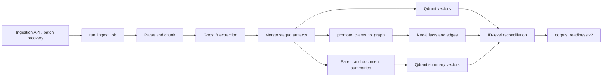
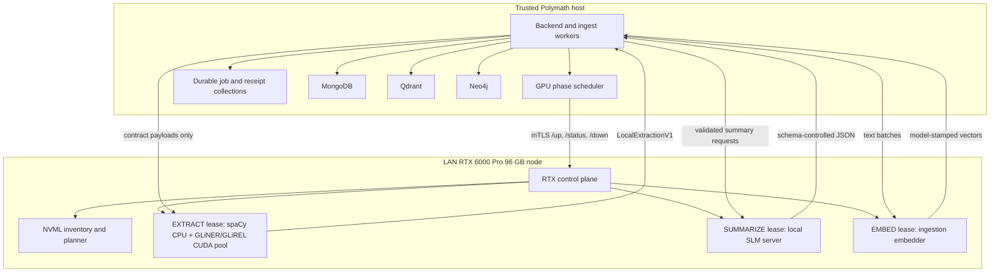

# Codebase Intent Gap Analysis

## Polymath RTX 96 GB Ingestion Deployment Design

**Verdict:** FAIL
**Repository:** `/Users/king/polymath_v3.3`
**Plan:** Owner request for a cold-start, VRAM-aware RTX ingestion node that runs deterministic extraction first, then replaces extraction runtimes with a local summary model.
**Revision:** `04bea1c` with 23 pre-existing dirty or untracked paths at audit time
**Audited at:** `2026-07-23T20:52:38-06:00`

The highest-impact gap is not extraction quality. Polymath already has a
production-shaped CUDA extraction sidecar, elastic endpoint probing, durable
jobs, claim promotion, and summary-vector reconciliation. The missing owner is
the RTX host control plane that implements `/up`, `/status`, and `/down`, plans
from CUDA VRAM, and enforces the extraction-to-summary phase transition.

## Intent Contract

### Outcomes

1. A file enters Polymath once and reaches parsed, chunked, extracted,
   summarized, embedded, graph-promoted, reconciled, and query-ready state.
2. The 96 GB RTX node starts cold on demand, publishes a measured capacity
   receipt, performs the assigned GPU phase, drains, and returns to `OFF`.
3. spaCy, GLiNER, GLiREL, deterministic fact compilation, embeddings, and local
   summary generation run through one scheduler without competing for VRAM.
4. MongoDB, Qdrant, and Neo4j remain the canonical stores behind the trusted
   Polymath backend. The RTX worker remains stateless and receives no database
   credentials.
5. A corpus becomes queryable only after ID-level reconciliation proves all
   required durable artifacts exist in their target stores.

### Constraints

- GPU capacity is measured from the RTX host. It is not inferred from the GPU
  product name or a fixed worker count.
- Extraction and summary runtimes hold mutually exclusive GPU leases unless a
  measured profile explicitly proves safe co-residency.
- Summary generation sends thinking disabled and accepts only locally compiled,
  Pydantic-valid artifacts.
- Every phase is idempotent and resumable from Mongo job state. A process exit
  must not turn completed work into an untracked retry.
- Secrets remain in the encrypted Polymath settings store or the RTX host
  secret store. They never enter corpus configuration, receipts, logs, or Git.

### Non-goals

- Do not mirror MongoDB, Qdrant, or Neo4j onto the RTX node.
- Do not give extraction containers direct write access to any canonical store.
- Do not replace Polymath's `LocalExtractionV1`, claim, summary, or readiness
  contracts.
- Do not hard-code the theoretical `96 / model_size` worker count.
- Do not move the interactive query path to the RTX node in this slice.

### Acceptance criteria

1. Cold `/up` returns a signed inventory and plan containing GPU UUID, driver,
   CUDA runtime, total/free VRAM, model hashes, worker count, batch shape,
   safety reserve, and plan hash.
2. The extraction phase passes a production-shaped canary, drains all active
   requests, stops every extraction process, and proves post-stop VRAM is below
   the configured idle ceiling before summary startup.
3. The summary phase starts one local OpenAI-compatible runtime with thinking
   disabled, validates every result through schema control, and quarantines
   invalid artifacts without writing them to canonical stores.
4. Final reconciliation proves set equality for required Mongo IDs against
   Qdrant summary IDs, zero pending graph-promotion jobs, and zero required
   documents outside terminal pipeline state.
5. `corpus_readiness.v2` is materialized as query-ready only after criteria 1
   through 4 have durable receipts.

## Actual Runtime

### Current production path



Graphify traced `run_ingest_job()` to `compile_local_extraction_v1()` in four
hops and to `write_document_graph()` in two hops. The fresh scan covered 1,402
code files and produced 26,537 nodes. Community interpretation produced 894
communities with LongCat thinking disabled.

The local Ghost B adapter is already the right worker boundary. It returns the
same `ExtractionResult` shape as cloud extraction, so Mongo staging, Qdrant, and
Neo4j do not care where compute ran
(`backend/services/ghost_b_local.py:1-7`). It accepts an ordered list of sidecar
URLs and distributes microbatches only to endpoints whose health response proves
an active CUDA provider (`backend/services/ghost_b_local.py:119-170`,
`backend/services/ghost_b_local.py:940-1069`).

The sidecar already publishes total, free, allocated, and reserved GPU memory
(`scripts/apple_ml_services/ghost_b_extract_svc/main.py:154-183`). It also has
an idle-exit path and one OOM-class retry after cache release
(`scripts/apple_ml_services/ghost_b_extract_svc/main.py:96-108`,
`scripts/apple_ml_services/ghost_b_extract_svc/main.py:264-298`).

The generic model-lifecycle client already starts, polls, quarantines, holds,
and stops independent model lanes
(`backend/services/ingestion/model_lifecycle.py:217-314`,
`backend/services/ingestion/model_lifecycle.py:317-389`,
`backend/services/ingestion/model_lifecycle.py:392-447`). Repository search
found clients and model fields for `/up`, `/status`, and `/down`, but no
production server that implements those endpoints.

The resource planner is still Mac-oriented. `SystemResources` has CPU, RAM,
cgroup, RSS, and Metal fields but no CUDA device or VRAM fields
(`backend/services/ingestion/resource_planner.py:25-69`). Its hardware probe
checks only Torch MPS (`backend/services/ingestion/resource_planner.py:171-212`).
The separate private-vLLM capacity helper can parse VRAM and clamp concurrency
to a safety budget, but it operates after a model server already exists
(`backend/services/private_vllm_capacity.py:11-24`,
`backend/services/private_vllm_capacity.py:127-192`).

### Target runtime



The scheduler owns this state machine:

```text
OFF
  -> INVENTORY
  -> EXTRACT_STARTING
  -> EXTRACT_READY
  -> EXTRACTING
  -> DRAINING
  -> OFF
  -> SUMMARY_STARTING
  -> SUMMARY_READY
  -> SUMMARIZING
  -> DRAINING
  -> OFF
  -> EMBED_STARTING
  -> EMBEDDING
  -> RECONCILING
  -> QUERY_READY
  -> OFF
```

Neo4j promotion is a CPU/database phase. It may overlap summary generation only
when store-pressure gates admit it. It never runs inside the GPU container.

### RTX 96 GB planning contract

The control plane derives a profile in two steps.

1. Static inventory reads NVML for GPU UUID, architecture, driver, CUDA runtime,
   total/free VRAM, power state, and active compute processes. It rejects
   display or foreign-process pressure above the configured reserve.
2. A calibration canary starts one runtime, executes production-shaped batches,
   samples peak VRAM and latency, then stores the result by GPU UUID, driver,
   model digest, pipeline version, precision, and batch shape.

For the first 96 GB profile, use these guardrails:

| Item | Initial policy |
|---|---|
| Global usable VRAM | `min(current_free, total_vram * 0.82)` |
| Hard free reserve | `max(12 GB, total_vram * 0.12)` |
| Extraction workers | Start 4, then admit measured slots; cap by CPU cores and p95 peak VRAM |
| Summary runtime | One model server, `gpu_memory_utilization <= 0.82`, thinking disabled |
| Embedding runtime | Exclusive lease by default; co-residency requires its own measured profile |

The current source notes a warm extraction process near 3.7 GB, but the live
sidecar also recorded a 71.8 GB allocator high-water event on a large document
(`backend/services/ghost_b_local.py:119-123`,
`scripts/apple_ml_services/ghost_b_extract_svc/main.py:186-203`). That evidence
rules out a fixed 20-plus-process deployment. The planner must use measured
peak deltas and drain or replace a worker whose allocator does not return below
its post-request ceiling.

The stored capacity receipt is the stable decision:

```json
{
  "schema_version": "polymath.rtx_capacity_receipt.v1",
  "gpu_uuid": "GPU-...",
  "total_vram_gb": 96.0,
  "model_digest": "sha256:...",
  "pipeline_version": "...",
  "phase": "extract",
  "batch_shape": {"microbatch": 8, "max_in_flight": 1},
  "peak_vram_per_worker_gb": 0.0,
  "worker_slots": 0,
  "hard_free_reserve_gb": 12.0,
  "plan_hash": "sha256:..."
}
```

Zero values are placeholders until the RTX canary measures the machine. The
control plane must not invent them from model size.

## Gap Matrix

| ID | Requirement | Expected evidence | Observed evidence | Status | Impact | Dependency | Smallest remediation | Verifier |
|---|---|---|---|---|---|---|---|---|
| REQ-001 | Deterministic LAN RTX extraction | Reachable ingest entrypoint, CUDA health, durable extraction result, passing canary | Entrypoint: `run_ingest_job`; wiring: `ghost_b_local` sidecar fleet; outcome: staged extraction rows; verification not run in this audit | PARTIAL | Existing compute can run, but live closure is unproved | RTX host online | Preserve adapter and add supervisor registration | One-file ingestion with CUDA health and `LocalExtractionV1` receipt |
| REQ-002 | CUDA and VRAM-aware resource plan | NVML inventory, measured model profile, deterministic plan receipt | Generic planner has no CUDA/VRAM; private-vLLM helper only clamps an already-running server | PARTIAL | Static ports and worker counts can OOM or leave most VRAM idle | REQ-003 | Add host inventory and profile planner behind the lifecycle status contract | Golden planner tests plus live 96 GB capacity receipt |
| REQ-003 | Cold RTX lifecycle server | Authenticated `/up`, `/status`, `/down` implementation controlling explicit containers | Repository search found lifecycle clients and no production endpoint owner | MISSING | Polymath cannot cold-start or replace GPU stacks on demand | None | Add one RTX control-plane service | Cold `OFF -> READY -> OFF` canary with process and VRAM proof |
| REQ-004 | Exclusive extraction-to-summary transition | Durable phase lease, active-request drain, container stop, VRAM floor, next runtime start | Extraction idle exit and model auto-stop exist separately; no cross-runtime phase owner exists | MISSING | Extraction and SLM processes can overlap or require manual switching | REQ-002, REQ-003 | Add backend GPU phase scheduler and lease collection | Kill/restart test resumes at the recorded phase without duplicate artifacts |
| REQ-005 | Schema-controlled local summaries | Thinking-off request, compiler, Pydantic validation, quarantine, durable summary | Provider schema-control and summary jobs exist; no live local RTX summary verifier ran | PARTIAL | Local SLM output cannot yet be trusted as production-complete | REQ-003, REQ-004 | Register local SLM as a managed summary lane | Invalid JSON canary quarantines; valid canary reaches Mongo |
| REQ-006 | Idempotent graph promotion | Staged claims become candidate facts/typed edges with per-document receipts | `run_graph_promotion_jobs()` calls `promote_claims_to_graph()`; current live backlog was not inspected | PARTIAL | Query graph may lag completed extraction | REQ-001 | Run promotion from durable job state after extraction | Zero pending promotion jobs plus fact/chunk corpus-isolation probe |
| REQ-007 | ID-level vector closure | Required Mongo ID set equals Qdrant indexed ID set after repair | `audit_parent_summary_vector_integrity()` computes `required_ids - indexed_ids`; Graphify traces it into corpus commander | PARTIAL | Summary text can exist while remaining invisible to retrieval | REQ-005 | Make the ID join a required final phase receipt | Empty set difference for every target collection |
| REQ-008 | Query-time readiness gate | Materialized readiness requires terminal document, summary, vector, and graph states | `corpus_readiness.v2` exists and reads job pressure; no end-to-end RTX canary traversed it | PARTIAL | UI can expose a corpus before the new GPU path is proven | REQ-004 through REQ-007 | Gate phase completion on readiness materialization | One source file reaches `query_ready=true`, then survives restart |

## Directory Contract

| Owner | Public contract | Target location | Forbidden responsibility |
|---|---|---|---|
| RTX hardware control | `/inventory`, `/up`, `/status`, `/drain`, `/down`; capacity and phase receipts | `rtx_control_plane/` | Mongo, Qdrant, Neo4j access |
| Polymath phase orchestration | Durable lease and state transition API | `backend/services/ingestion/gpu_phase_scheduler.py` | Starting Docker or PowerShell directly |
| Hardware-independent admission | CPU/RAM/store pressure plus remote capacity result | `backend/services/ingestion/resource_planner.py` | NVML probing on another host |
| Extraction adapter | `LocalExtractionV1` requests and validated results | `backend/services/ghost_b_local.py` | Lifecycle ownership or canonical writes |
| Generic model lifecycle | Start, status, quarantine, hold, stop client | `backend/services/ingestion/model_lifecycle.py` | Provider-specific GPU arithmetic |

Planned source ownership:

```text
rtx_control_plane/
  main.py                 authenticated HTTP contract
  inventory.py            NVML and process inventory
  planner.py              measured profile and slot calculation
  runtime.py              container start, drain, stop, and phase lock
  contracts.py            strict request, status, and receipt models
  profiles/               versioned extraction, summary, and embed manifests
  tests/

backend/services/ingestion/
  gpu_phase_scheduler.py  durable host-side phase state machine

backend/models/
  gpu_runtime.py          shared wire contracts

scripts/
  install_rtx_control_plane.ps1

docker-compose.rtx-ingest.yml
```

The RTX service should run under Windows Task Scheduler or a small Linux host
service and control Docker containers. It should not run one Task Scheduler
entry per extraction port. The current PowerShell launcher hard-codes one
Uvicorn process per invocation and static batch sizes
(`scripts/apple_ml_services/run_sidecar_windows.ps1:1-34`); keep it as a
rollback path until the supervisor passes acceptance.

## Remediation Order

1. Build `rtx_control_plane` with read-only inventory, authenticated lifecycle
   endpoints, an exclusive host lock, and canonical capacity receipts.
   Exit verifier: one cold extraction container reaches ready, drains, stops,
   and returns VRAM below the idle ceiling.
2. Add `gpu_phase_scheduler.py` and a Mongo lease keyed by RTX node plus GPU
   UUID. Reuse `model_lifecycle.py` as the transport client.
   Exit verifier: two ingest workers cannot acquire conflicting phases.
3. Register the existing Ghost B sidecar fleet as the `EXTRACT` profile. Feed
   supervisor-selected URLs into the existing endpoint list.
   Exit verifier: one document produces the same validated extraction contract
   before and after a cold restart.
4. Add `SUMMARIZE` and `EMBED` profiles. Require drain, stop, and VRAM-floor
   proof between profiles; route summary output through schema control.
   Exit verifier: malformed local output quarantines and valid output reaches
   the summary-vector ID join.
5. Make corpus commander require extraction, summary, vector, graph, and
   readiness receipts before query activation.
   Exit verifier: a killed run resumes without duplicate graph facts or stranded
   summary vectors and finishes with an empty reconciliation set.

Rollback is profile-level. Disable the RTX node in settings and keep the
existing RunPod, cloud-summary, and Mac-sidecar routes unchanged. No canonical
data migration is required.

## Verification Record

| Check | Result |
|---|---|
| Repository inventory | PASS: 2,628 files, 22 schemas, 346 tests identified |
| Fresh Graphify structural extraction | PASS: 1,402 code files, 26,537 nodes, raw 67,436 edges |
| LongCat community interpretation | PASS: 894 communities; thinking disabled; output isolated under `/private/tmp/polymath-rtx-graphify.FL56Dq` |
| Critical-path traversal | PASS: ingest to local extraction, graph write, model lifecycle, promotion, and vector reconciliation nodes found |
| Live RTX deployment or pipeline canary | NOT RUN: no RTX endpoint or host credential was supplied to this audit |

The LongCat credential was passed only as a process environment value for the
isolated Graphify run. It was not written to the repository, generated graph,
or this report.

## Residual Unknowns

1. RTX host OS, CPU core count, RAM, Docker runtime, NVIDIA driver, CUDA runtime,
   GPU UUID, and currently free VRAM. Resolve with the new `/inventory` endpoint.
2. Production peak VRAM for GLiNER plus GLiREL on representative long documents.
   Resolve with 1, 10, and 100-document calibration receipts.
3. The local summary model and precision that meet Polymath's summary-quality
   gate. Resolve with the existing summary contract eval before profile lock.
4. LAN identity and transport policy. Resolve by choosing mTLS or a private
   overlay network before exposing the control endpoint.
5. Whether ingestion embeddings stay on the Mac or move to the RTX `EMBED`
   phase. Resolve after measuring LAN transfer plus write throughput.

**Next action:** implement remediation slice 1 only, then use its live capacity
receipt to set worker counts and model profiles.
