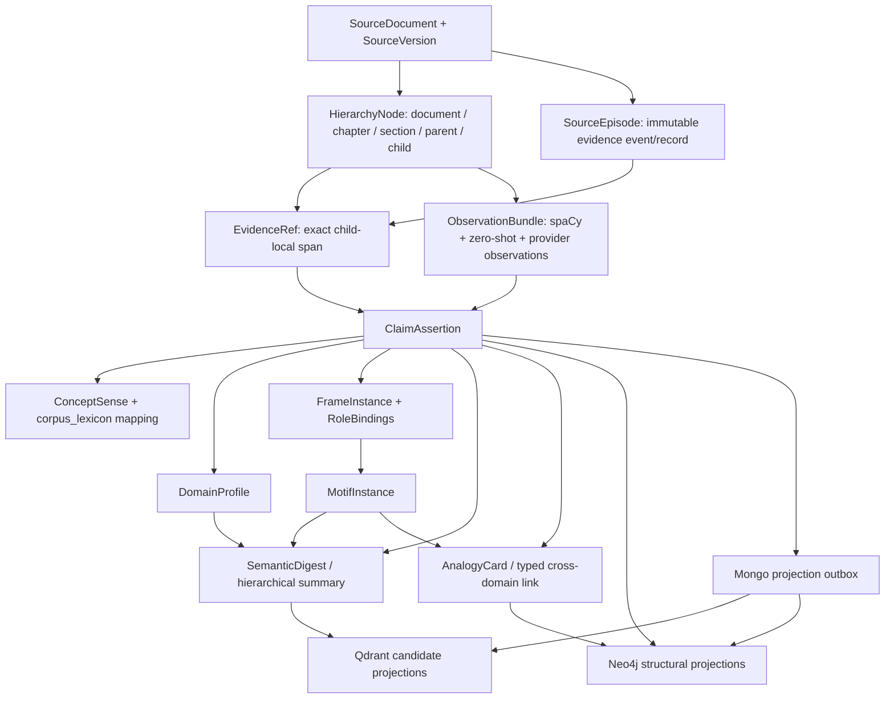

# Polymath Final Semantic Schema And Metadata Architecture

**Date:** 2026-07-13  
**Status:** decision-ready canonical target; executable feasibility slice
complete; not deployed  
**Scope:** semantic artifacts, provenance, identity, hashes, store ownership,
and migration boundaries for the future S11-S14 program  
**Not in scope:** model-quality claims, threshold calibration, live migration,
deployment, or a production-wide refactor

## Executive decision

Polymath should keep its existing hierarchy, hierarchical summaries,
deterministic Python, zero-shot extraction, spaCy, corpus lexicon, and bounded
generative synthesis. The improvement is not another extraction engine. It is
one canonical semantic contract that makes those components agree about:

- what is source evidence;
- what is an extractor observation;
- what is an accepted claim;
- what is a domain, concept sense, frame, motif, summary, or analogy;
- what produced an artifact and under which recipe;
- which identifier is stable semantic identity and which hash merely records a
  run, revision, motif, cache entry, or projection;
- which store is authoritative and which stores are rebuildable projections.

The target is a **linked artifact model with one shared envelope**, not one
large JSON object per parent and not a second semantic graph beside the current
system. MongoDB remains authoritative. Qdrant and Neo4j are projections.
`corpus_lexicon` remains the concept authority. The Mongo hierarchy remains the
structural authority.

The temporal report's `FactAssertion` and the semantic plan's `Claim` are
merged into one `ClaimAssertion` family. A claim may be relational, causal,
definitional, comparative, conditional, procedural, event-like, or a property;
it is not forced into a subject-predicate-object triple. Temporal validity is a
qualifier on the same assertion, not a parallel truth store.

The author's research is architecturally stronger than the current future
plan in five modular respects:

1. It separates domain, concept, mechanism-frame, motif, and analogy instead of
   using topical similarity as mechanism proof.
2. It makes exact child evidence and accepted claims precede semantic parent
   digests.
3. It gives deterministic Python and registries final persistence authority.
4. It uses zero-shot and spaCy output as observations and candidates, not as
   unquestioned truth.
5. It reserves generative models for bounded, schema-grounded ambiguity and
   synthesis.

Its fixed taxonomies, weights, thresholds, and quality claims remain
experimental recipe parameters. They do not belong in immutable artifact
identity and are not promoted to universal constants by this decision.

## Source basis and evidence boundary

This decision cross-references repository truth and the author's two
unpublished research drafts. It intentionally adds no outside research.

| Input | Role | SHA-256 |
|---|---|---|
| `82a32e4d.../pasted-text.txt` | domain/concept/frame/motif hierarchy, profiles, cross-linking, structured summaries | `a00b8a2bf6adef7296ba833c5b98b994b22ff0d934eb865cd1f26394bb25512f` |
| `dcb3fd3a.../pasted-text.txt` | deterministic-first Python + spaCy + zero-shot + bounded-LLM processing design | `30199aa0fc59b98a4b58d8bff68e64555164dd805323ce6e7bbacb4f4d863160` |
| Current branch | actual implementation and audited S0-S14 plan | `claude-continuation-20260713` at `d9ea44c` before these documentation edits |

The architecture is accepted on logical modularity, replayability, evidence
discipline, and consistency with the repository. A small adversarial fixture
now establishes feasibility and exposes current model failures; diverse
corpus-scale numerical quality remains an open empirical gate.

## The final system boundary



Three lanes remain deliberately separate:

1. **Source lane:** deterministic parsing, hierarchy, source versions, exact
   coordinate systems, and evidence spans.
2. **Observation lane:** spaCy linguistic structure, zero-shot spans and
   relations, provider-LLM extraction, raw output, and candidate scores.
3. **Accepted semantic lane:** Python-validated claims, sense mappings, domain
   profiles, frames, motifs, digests, and analogy cards.

No observation becomes accepted knowledge merely because it parsed, scored
highly, came from a generative model, or matched a registry label.

## Store authority

| Concern | Authoritative owner | Rebuildable consumers |
|---|---|---|
| logical documents, source versions, and evidence episodes | Mongo `documents` + future `source_versions`/`source_episodes` | Qdrant and Neo4j metadata |
| document/parent/child hierarchy and source text | Mongo current hierarchy collections | Qdrant points; minimal Neo4j references |
| extractor/spaCy observations and raw output receipts | Mongo observation/run records | diagnostics only unless validated |
| accepted claims, frames, motifs, digests, analogies | Mongo semantic artifact collections | Qdrant and Neo4j |
| canonical corpus concepts | existing `corpus_lexicon` | Qdrant schema/gloss points; Neo4j mapping projection if needed |
| source-local meaning | new `concept_senses` and `concept_mappings` | claim/frame/analogy projections |
| domain and frame definitions | versioned registry data in repository plus registry snapshots/hashes in Mongo | all semantic compilers |
| vectors and filter payloads | never source truth | Qdrant only |
| structural traversal | never source truth | Neo4j only |
| projection intent/retry | Mongo `projection_outbox` and `projection_manifests` | Qdrant/Neo4j workers |

This rejects two tempting refactors:

- duplicating the entire document hierarchy in Neo4j; and
- storing full semantic truth only as Qdrant payloads or graph edges.

## Current-state cross-reference and severe findings

| Current seam | What is worth keeping | What is structurally wrong | Final disposition |
|---|---|---|---|
| `models/contracts.py` | typed entity/relation/fact, retrieval, graph, reranker, and parent-summary boundaries | contract coverage stops before claims, conditions, senses, roles, derivations, and a shared envelope; active provider lanes do not cleanly fit its extractor enum | keep as compatibility contracts; add a new semantic-contract module and adapters |
| `source_identity.v1` | strong URL/video/content identity and duplicate prevention | `doc_id` is parsed normalized-content hash, so logical document identity and source-version identity are conflated | preserve current IDs as legacy aliases; introduce logical `doc_id` plus `source_version_id` without guessing lineage |
| `stage_identity.v1` | explicit input and contract hashes make retries safer | different stages invent different hash shapes; canonicalization uses permissive `default=str`; schema, registry, recipe, work, output, and semantic identity are not distinguished | replace only for new semantic artifacts with the hash taxonomy below; adapt legacy identities |
| parent/child IDs | deterministic ordinal IDs are resumable inside a frozen parse/chunk recipe | IDs do not include a chunking recipe or coordinate contract; re-chunking changes meaning while cross-version lineage is invisible | retain as legacy node IDs; new node revisions bind source version + hierarchy recipe + boundary/ordinal |
| `parent_summary.v1` | bounded fields, source hash, child anchors, validation, quality flags | `summary_id` is parent-only, schema/model fields can be optional, and current Ghost A summarizes text rather than accepted claims | keep current retrieval summary; add a separate claim-grounded semantic-digest recipe and compare before cutover |
| `summary_tree.v1` | hierarchy-aware rollup/section/document routing | ordinal node IDs can overwrite changed grouping; summaries have no accepted-claim support contract | preserve routing tree; future revisions bind input-set and recipe hashes and cite claim IDs |
| `ghost_b_extractions` | large, reusable ERE observation base and provider receipts | raw-output handle, stage identity, and accepted semantic identity are mixed; entity/relation/fact output cannot express an n-ary qualified proposition | adapt into `ObservationBundle`; never relabel legacy triples as accepted claims without validation |
| `corpus_lexicon.v3` | evidence-bearing aliases, definitions, usages, source IDs, materialized Qdrant glosses | corpus canonical keys cannot disambiguate every local sense; ID can change when reconciliation components change | remain canonical concept store; add source-local senses and typed cross-corpus mappings, not a parallel lexicon |
| global `entity:{slug}` | cheap cross-corpus entity recall | homonyms and polysemy can collapse because surface identity is global | keep for legacy recall; claim arguments bind source-local sense/entity observations before global mapping |
| `librarian_card.v0` | deterministic evidence-bearing document projections and bridge-seat substrate | mechanisms/principles are strings/IDs without frame roles, direction, invariant, or break conditions | preserve as baseline and routing consumer; validated analogy cards feed it only after gates pass |
| Neo4j `RELATES_TO` | useful recall and graph candidate generation | merge by subject/predicate/object blends assertion versions, scope, modality, and evidence; generic `related_to` is not semantic proof | retain compatibility projection; new accepted projection keys by assertion ID and never creates a new generic relation |
| Qdrant point IDs and payloads | deterministic upsert and separate raw-child/summary/tree/concept lanes | point identity omits projection profile; schema/version fields are fragmented; a vector recipe change can overwrite the same point unless collection policy prevents it | point IDs bind artifact + representation role + projection profile; collection manifest must freeze embedding compatibility |
| temporal `FactAssertion` proposal | source versions, episodes, validity, scope, outbox, immutable assertions | triple-only shape is too narrow and would become a second claim store | merge into `ClaimAssertion`; temporal fields become qualifiers and projections |

Additional high-risk inconsistencies:

- `ParentSummaryRecord` describes a strict canonical record while many of its
  most important provenance fields are optional.
- `schema_version` sometimes means body schema, sometimes tree/profile format,
  sometimes a payload field, and sometimes a compiler contract.
- `source_hash` can mean parent text, raw file bytes, extraction input, or a
  fallback contract value depending on the collection.
- `raw_output_artifact_id` is a provider-output receipt, not the ID of the
  semantic claims inferred from that output.
- `stable_stage_hash` and current job IDs are work/idempotency identities, not
  evidence or semantic identities.
- Qdrant `text_hash` is an integrity check for a projection, not a durable
  source hash.
- a motif fingerprint will be a candidate bucket key, not proof of a valid
  analogy.

These distinctions are mandatory in the final schema.

## Shared artifact envelope

Every new durable semantic artifact uses
`polymath.artifact_envelope.v1`. Existing collections are not bulk-rewritten
merely to look uniform; compatibility adapters expose their equivalent fields.

```json
{
  "envelope_version": "polymath.artifact_envelope.v1",
  "artifact_type": "claim_assertion",
  "schema_id": "polymath.claim_assertion",
  "schema_version": "1.0.0",
  "schema_hash": "sha256:...",
  "artifact_id": "claim:...",
  "artifact_revision_id": "revision:...",
  "artifact_state": "candidate|validated|active|rejected|quarantined|superseded",
  "knowledge_status": "asserted|entailed|cross_passage_synthesis|structural_analogy|hypothetical|null",
  "ownership": {
    "corpus_id": "...",
    "doc_id": "...",
    "source_version_id": "...",
    "hierarchy_node_id": "...|null"
  },
  "integrity": {
    "body_hash": "sha256:...",
    "evidence_set_hash": "sha256:...|null",
    "input_set_hash": "sha256:...",
    "recipe_hash": "sha256:...",
    "registry_set_hash": "sha256:...|null"
  },
  "provenance": {
    "work_id": "work:...",
    "attempt_id": "attempt:...|null",
    "raw_artifact_ids": [],
    "producer_kind": "python_rule|spacy|zero_shot|provider_llm|human|migration",
    "engine": "...",
    "model_id": "...|null",
    "model_revision": "...|null",
    "prompt_id": "...|null",
    "prompt_hash": "sha256:...|null",
    "compiler_version": "...",
    "parser_version": "...|null",
    "rule_pack_version": "...|null",
    "run_id": "..."
  },
  "validation": {
    "contract_valid": true,
    "evidence_valid": true,
    "registry_valid": true,
    "policy_valid": true,
    "validator_version": "...",
    "errors": [],
    "warnings": []
  },
  "lifecycle": {
    "created_at": "RFC3339",
    "validated_at": "RFC3339|null",
    "activated_at": "RFC3339|null",
    "supersedes_revision_id": "...|null",
    "superseded_at": "RFC3339|null"
  },
  "body": {}
}
```

### Envelope invariants

- `artifact_id` is stable logical identity and excludes timestamps, run IDs,
  provider name, model name, confidence, and telemetry.
- `artifact_revision_id` identifies one immutable schema-valid body revision.
- producer/model/prompt changes belong to provenance and `recipe_hash`.
- validation state is not part of semantic identity. Revalidation may activate
  or reject a revision without changing what it claims to represent.
- timestamps are excluded from hashes unless time is part of the assertion's
  source meaning, validity, or lifecycle identity.
- `knowledge_status` is required only for artifacts that can be mistaken for
  knowledge: claims, digests, and analogies. Registry definitions and
  projection manifests use `null`.
- full confidence detail is field-level where possible; a top-level score must
  never erase the contributing scores and methods.

## Canonical JSON and hash contract

All new hashes use SHA-256 with a `sha256:` prefix and an explicit domain tag.
Canonical JSON is UTF-8, object keys sorted recursively, arrays kept in semantic
order unless a field is declared a set, no insignificant whitespace, finite
JSON numbers only, UTC RFC3339 timestamps, and no implicit string conversion.
Set-valued arrays are normalized, deduplicated, and sorted before hashing.

Conceptual function:

```text
hash(domain_tag, value) =
  "sha256:" + sha256(domain_tag + US + canonical_json(value))
```

`US` is the byte `0x1f`. Domain tags prevent the same JSON value from becoming
the same identifier across unrelated identity namespaces.

### Required hash taxonomy

| Name | Includes | Excludes | Purpose |
|---|---|---|---|
| `source_content_hash` | exact raw source bytes | parsed/normalized text | exact source version evidence |
| `normalized_text_hash` | explicitly versioned normalization output | raw-byte identity | stage invalidation and compatibility only |
| `schema_hash` | canonical generated JSON Schema for one body schema | code timestamps | contract identity |
| `registry_hash` | one canonical registry snapshot | runtime confidence | domain/frame/motif vocabulary identity |
| `registry_set_hash` | sorted registry IDs, versions, and hashes | unused registries | exact semantic vocabulary inputs |
| `recipe_hash` | schema hash, registry-set hash, parser/compiler/rule/model/prompt/config versions | run time, retry count, metrics | reproducible transformation recipe |
| `input_set_hash` | ordered or declared-set artifact revision IDs consumed | raw provider telemetry | exact derivation inputs |
| `body_hash` | canonical artifact body | envelope lifecycle and provenance | immutable body integrity |
| `evidence_set_hash` | canonical exact evidence refs | inferred prose | evidence integrity |
| `scope_hash` | canonical normalized semantic/temporal scope | confidence | assertion comparison and filtering |
| `motif_fingerprint` | readable ordered structural signature under a motif compiler version | confidence and source IDs | bounded candidate bucketing only |
| `projection_profile_hash` | store, representation role, embed profile, payload schema, quantization/search compatibility | point write time | projection compatibility |

### Identifier recipes

These are logical recipes; exact prefixes and field serializers are frozen in
code tests during HOW.

```text
doc_id = hash("logical-document", corpus_id + strong_source_key)
source_version_id = hash("source-version", doc_id + source_content_hash)

hierarchy_node_id = hash(
  "hierarchy-node",
  source_version_id + hierarchy_recipe_id + node_type + coordinate_or_ordinal
)

evidence_ref_id = hash(
  "evidence-ref",
  source_version_id + hierarchy_node_id + coordinate_system
  + start + end + quote_hash
)

claim_id = hash(
  "claim",
  ownership_namespace + knowledge_status
  + sorted(evidence_ref_ids) + sorted(derivation_parent_ids)
  + canonical_proposition_signature + scope_hash
)

artifact_revision_id = hash(
  "artifact-revision",
  artifact_id + schema_hash + body_hash
)

work_id = hash(
  "semantic-work",
  artifact_type + input_set_hash + recipe_hash
)

raw_artifact_id = hash("raw-output", exact_raw_output_bytes)

projection_point_id = uuid_from_sha256(
  artifact_id + representation_role + projection_profile_hash
)
```

If a strong external source key does not exist, Polymath must not infer that
two changed uploads are versions of the same logical document. It preserves
the current `doc_id` as a legacy identity and requires owner or explicit source
lineage to bind later versions.

The canonical proposition signature includes claim type, predicate/argument
roles, polarity, modal force, assertion mode, conditions, exceptions, and
semantic temporal validity where present. `knowledge_status` and derivation
parents distinguish an author assertion from an otherwise text-identical
entailment or cross-passage synthesis.

Retries of the same deterministic work reuse `work_id`. Individual execution
attempts receive an `attempt_id`; stochastic outputs receive distinct
`raw_artifact_id` values. This prevents a retry identifier, provider response
hash, or semantic claim ID from masquerading as another.

## Canonical artifact families

### 1. SourceDocument and SourceVersion

`SourceDocument` is stable logical lineage. `SourceVersion` is immutable source
content. The current content-derived `doc_id` is retained as `legacy_doc_id`
until a safe lineage mapping exists.

Required `SourceVersion.body` fields:

- `doc_id`, `source_version_id`, `legacy_doc_id`;
- exact `source_content_hash` and source identity record;
- title/author/organization, edition/version labels, language, source role;
- publication, modified, effective, file-created, and recorded times as
  separate fields with origin and precision;
- normalized scope and `scope_hash`;
- predecessor/supersession references;
- parse artifact and parse-recipe references.

### 2. HierarchyNode

Represents document, chapter, section, parent, child, sentence, or other
explicit structural nodes without asking a semantic model to invent clean
structure. Required fields:

- `node_type`, `source_version_id`, `parent_node_id`, ordered child IDs;
- heading path and ordinal;
- exact durable text or authoritative text reference;
- coordinate system and available start/end bounds;
- text/body hash, parser recipe, chunker recipe, chunk kind, language;
- current `doc_id`, `parent_id`, and `chunk_id` compatibility aliases.

When source-global offsets do not exist, the schema records `chunk_char` and
does not fabricate page or source-global coordinates.

### 3. SourceEpisode and EvidenceRef

`SourceEpisode` is the immutable evidence event/record retained from the
temporal design. It represents a document-version observation, imported web
record, transcript segment, or owner correction and carries `episode_id`,
source version, hierarchy/record reference, content hash, recorded/reference
time, scope, and one or more evidence refs. It does not duplicate the entire
document hierarchy. Text passages normally use their child hierarchy node as
the episode anchor; non-text records must name an equally deterministic field
coordinate contract.

Every accepted explicit claim and every two-sided analogy endpoint cites exact
evidence:

```json
{
  "evidence_ref_id": "evidence:...",
  "source_version_id": "...",
  "hierarchy_node_id": "child:...",
  "coordinate_system": "chunk_char|record_field|media_offset",
  "start": 120,
  "end": 186,
  "quote": "exact durable substring",
  "quote_hash": "sha256:..."
}
```

For `chunk_char`, validation requires
`durable_child_text[start:end] == quote`. Other coordinate systems require an
equivalent byte-/field-exact round trip under their versioned coordinate
contract. A child/parent/episode ID without an exact quote or record value is
supporting context, not an exact evidence span.

### 4. ObservationBundle

Provider-neutral, per-child candidate data. It can include:

- sentence boundaries and spaCy dependency/parser version;
- subjects, predicates, objects, modals, negation, conditions, comparisons,
  causal/temporal cues, and exact offsets;
- zero-shot entity/concept/state/process spans;
- explicit local-relation observations;
- current `ExtractedEntity`, `ExtractedRelation`, and `ExtractedFact` adapters;
- candidate scores, methods, label-pack version, and validation drops;
- raw output references and producer recipe.

Observation bundles are durable replay inputs but have no `ASSERTED` status.
The same child may have comparable deterministic, zero-shot, and provider-LLM
bundles. The validator may reconcile them; storage does not silently collapse
them.

### 5. ClaimAssertion

This replaces both a triple-only future `FactAssertion` and a separate semantic
claim store.

```json
{
  "proposition_text": "Repeated discounting may lower consumers' expected price.",
  "canonical_proposition": "repeated discounting POSSIBLE decrease consumer expected price",
  "claim_type": "causal",
  "predicate_id": "decreases",
  "arguments": [
    {
      "role": "cause",
      "filler_kind": "concept_sense",
      "filler_ref": "sense:...",
      "surface": "Repeated discounting",
      "evidence_ref_id": "evidence:..."
    },
    {
      "role": "affected_state",
      "filler_kind": "concept_sense",
      "filler_ref": "sense:...",
      "surface": "consumers' expected price",
      "evidence_ref_id": "evidence:..."
    }
  ],
  "polarity": "affirmed",
  "modal_force": "possible",
  "assertion_mode": "reported",
  "conditions": [],
  "exceptions": [],
  "semantic_scope": {},
  "scope_hash": "sha256:...",
  "temporal": {
    "valid_from": null,
    "valid_to": null,
    "reference_time": null,
    "temporal_class": "slowly_evolving",
    "temporal_status": "unknown",
    "time_origin": "unknown"
  },
  "evidence_refs": ["evidence:..."],
  "evidence_episode_ids": ["episode:..."],
  "domain_profile_id": "domain-profile:...",
  "frame_instance_ids": ["frame-instance:..."],
  "derivation_parent_ids": []
}
```

Rules:

- explicit source claims use `knowledge_status=asserted`;
- deterministic, source-licensed implications may use `entailed` with parent
  claims and a named inference rule;
- parent/chapter/document synthesis uses `cross_passage_synthesis` and cannot
  supersede an explicit assertion;
- hypothetical source claims remain assertions about a hypothetical, not
  observed facts;
- analogies use `AnalogyCard`, never a promoted asserted claim;
- corrections and temporal supersession create new immutable revisions or
  assertions under explicit comparison rules; predictions do not supersede
  observations.

### 6. ConceptSense and ConceptMapping

`ConceptSense` represents what a phrase means in one source-local context.
It carries the exact span, normalized local gloss, source context, and optional
entity observation.

`ConceptMapping` relates a sense or another corpus's lexicon entry to an
existing `corpus_lexicon` entry with one typed mapping:

- `exact`;
- `close`;
- `broader`;
- `narrower`;
- `related`;
- `unresolved`.

Every mapping records evidence, method, score, registry/lexicon version, and
validation. `related` is lexical association and can never become a causal
edge. Cross-corpus mappings link existing corpus lexicon IDs; they do not create
a second global concept store.

### 7. DomainRegistry and DomainProfile

The proposed 16 macro-domains become the seed snapshot of a versioned
`DomainRegistry`. Each entry has a stable ID, parent, preferred label, aliases,
definition, status, and optional concept mappings.

`DomainProfile` targets a source document, hierarchy node, claim, or digest:

```json
{
  "target_artifact_id": "claim:...",
  "assignments": [
    {
      "domain_id": "D06.marketing.pricing",
      "assignment_role": "primary",
      "score": 0.88,
      "method": "concept_relation_rule",
      "evidence_ref_ids": ["evidence:..."],
      "supporting_claim_ids": []
    }
  ],
  "proposals": [],
  "context_profile_ids": []
}
```

Cardinality caps, aggregation weights, affinity priors, alias thresholds, and
new-domain promotion requirements live in the versioned recipe/policy, not in
the schema. Claim evidence must dominate inherited parent/chapter/document
context. Unknown labels remain proposals until deterministic or human policy
promotes them.

### 8. FrameRegistry and FrameInstance

The proposed 16 mechanism frames become the seed `FrameRegistry`, not a proven
universal ontology. A registry entry defines:

- stable frame ID and description;
- required and optional typed roles;
- role cardinality;
- allowed filler kinds;
- directional and state-transition constraints;
- incompatible conditions and abstention rules;
- registry version and hash.

`FrameInstance` targets one or more accepted claims and includes:

- frame ID and primary/secondary role;
- typed role bindings to concept senses, entities, states, processes, literals,
  or other accepted claims;
- exact evidence or claim argument references per binding;
- direction, polarity, temporal order, scale, and conditions;
- candidate sources and scores;
- validation and abstention reason.

Schema-valid role objects still require evidence and registry-policy
validation.

### 9. MotifInstance

A motif is an ordered, readable abstraction over validated frames and state
transitions. It includes:

- ordered frame-instance IDs;
- abstract role types and their source bindings;
- direction, polarity, input/output states, conditions, scale, and temporal
  ordering;
- supporting claim IDs and exact evidence chains;
- optional approved motif registry ID;
- `motif_fingerprint`, fingerprint compiler version, and readable signature;
- `known|provisional|rejected` status.

The fingerprint is used for bounded candidate buckets. Equality is neither
semantic truth nor permission to materialize an analogy.

### 10. RetrievalSummary and SemanticDigest

Current Ghost A and `summary_tree.v1` artifacts remain
`RetrievalSummary` recipes. They are useful now and are not falsely relabeled
as claim-grounded.

The proposed parent call creates a separate `SemanticDigest` only after child
claims are accepted. It contains:

- target hierarchy node and level;
- bounded summary and thesis;
- major/supporting claim IDs;
- domain-profile reference;
- dominant frame instances/distribution with supporting claims;
- motif IDs with supporting claims;
- conditions, exceptions, uncertainties, and unresolved questions;
- input-set hash and source child IDs;
- `knowledge_status=cross_passage_synthesis`.

Every generated field that changes meaning must cite accepted claim IDs. Python
validates references, registry IDs, cardinality, and evidence closure. A digest
routes retrieval and explains argument structure; child evidence remains the
citation authority.

### 11. AnalogyCard

The accepted cross-domain artifact is a typed card, not `RELATED_TO`:

- source and target claim IDs, source versions, documents, corpora, and senses;
- typed link class such as same mechanism, same motif, contrast,
  contradiction, broader principle, narrower instance, application, or
  structural analogy;
- shared/compatible frames and motifs;
- typed role alignment;
- compatible causal direction and temporal/scale context;
- explicit invariant;
- differences, break conditions, and forbidden transformations;
- two exact evidence chains;
- component scores, calibrated policy ID, and candidate generators;
- `knowledge_status=structural_analogy` for analogical transfer;
- derivation and validator versions.

Analogy is non-transitive. It may nominate documents or a librarian bridge
seat. It may not become an unsupported answer claim.

### 12. ProjectionManifest and ProjectionOutbox

Every Qdrant/Neo4j projection is reproducible from an authoritative artifact.

`ProjectionManifest` freezes:

- target store and collection/index;
- source artifact types and schema hashes;
- representation role (`raw_child`, `retrieval_summary`, `semantic_digest`,
  `claim`, `concept_gloss`, `motif_signature`, `routing_card`);
- embedding model ID/revision, dimension, distance, query/document prompt
  profile, sparse recipe, payload schema, and quantization/search profile;
- `projection_profile_hash`;
- active/previous manifest and rollback state.

`ProjectionOutbox` carries artifact revision, desired operation, projection
profile, idempotent projection key, lease/retry state, and reconciliation
receipt. Request paths do not perform untracked multi-store dual writes.

## Metadata placement rules

| Metadata | Canonical location | Projection behavior |
|---|---|---|
| corpus/doc/source ownership | envelope ownership | copy only fields needed for isolation/hydration |
| exact evidence and quote | EvidenceRef in Mongo | Qdrant/Neo4j store IDs and compact diagnostics, not duplicate truth |
| model/prompt/parser/rules | provenance + recipe snapshot | compact recipe/profile IDs |
| schema and registries | envelope integrity + registry snapshots | schema/profile hashes |
| confidence | artifact field or candidate record with method | copy only rank/filter values that have a named consumer |
| lifecycle state | envelope lifecycle | compact active/superseded flags |
| temporal validity/scope | ClaimAssertion | indexed epoch/range projection where consumed |
| hierarchy | Mongo HierarchyNode/current collections | IDs and minimal route context only |
| embedding instruction/profile | ProjectionManifest | point payload/profile ID and collection manifest |
| analogy invariant/breaks | AnalogyCard | IDs/short diagnostics; hydrate full card before explanation |

No field is copied to a projection without a named filter, ranker, hydrator, or
diagnostic consumer. No authoritative field exists only in a projection.

## Final processing order

### A. Deterministic source construction

1. Resolve source identity and immutable source version.
2. Parse document hierarchy and metadata.
3. Emit document/chapter/section/parent/child nodes with explicit coordinate
   systems and recipe identity.
4. Preserve current retrieval summaries as their existing recipe family.

### B. Child observation and claim compilation

5. Run a pinned trained spaCy pipeline for sentence/dependency/qualifier
   observations; blank spaCy is insufficient for this lane.
6. Run GLiNER or another zero-shot producer for configurable span candidates.
   Store GLiREL/Relex relation output as observations only until the selected
   model/ontology clears the relation-quality gate.
7. Run the existing provider-LLM lane on identical labels for the comparison
   baseline where configured.
8. Persist provider-neutral observation bundles and raw receipts.
9. Deterministic Python builds atomic claim candidates while preserving modal,
   polarity, condition, exception, direction, and temporal cues.
10. Exact-span and schema validation accepts, rejects, or quarantines claims.

### C. Registry resolution and bounded synthesis

11. Resolve source-local senses against `corpus_lexicon`; retain typed
    unresolved/cross-corpus mappings.
12. Produce domain candidates from concepts, relations, headings, and bounded
    inherited context.
13. Produce frame candidates from relation rules, roles, dependency patterns,
    state transitions, and registry constraints.
14. Aggregate accepted child artifacts into a bounded parent evidence packet.
15. Make one schema-grounded parent semantic-digest call for ambiguity,
    latent concepts, cross-claim mechanism, conditions, exceptions, and motif
    proposals.
16. Python validates every output and gives unknown registry items proposal
    status only.
17. Aggregate accepted parent digests to chapter and document levels under
    separate recipes.

### D. Candidate projection and cross-domain validation

18. Project claims, digests, concept mappings, frame/motif signatures, and
    routing metadata through the outbox.
19. Generate bounded cross-book candidates by exact/compatible motif and frame
    buckets plus existing lexical/vector/topology nominators.
20. Validate roles, direction, senses, context, invariant, breaks, forbidden
    transformations, and two-sided evidence.
21. Materialize only accepted typed analogy cards; explain only hydrated cards.

## What changes and what does not

### Preserved

- current Mongo hierarchy and small-to-big hydration;
- raw child embeddings and separate parent/tree/document summary lanes;
- `corpus_lexicon.v3` and current librarian cards;
- Fast, Hybrid, and Graph isolation and original-query protection;
- existing ERE and graph candidate inputs;
- canonical asymmetric Qwen profile: instructed queries and the collection's
  frozen document profile;
- additive/canary/clone-first rollout discipline.

### Replaced in the future plan

- separate temporal assertion and semantic claim stores -> one
  `ClaimAssertion` family;
- loose per-collection metadata conventions -> one shared artifact envelope;
- ambiguous hash names -> explicit hash taxonomy;
- provider-specific semantic output shapes -> `ObservationBundle` adapters;
- parent-only summary identity -> logical summary/digest identity plus immutable
  recipe/body revisions;
- global surface identity as meaning -> source-local sense then lexicon/entity
  mapping;
- generic graph relation as mechanism proof -> claim/frame/motif/analogy
  validation;
- direct multi-store writes for new semantic artifacts -> Mongo outbox and
  projection manifests.

### Not frozen by this schema

- the 16-domain and 16-frame registries beyond seed version 0;
- domain/frame weights, score thresholds, cardinality policies, motif library,
  chunk sizes, or permanent-link thresholds;
- whether a fine-tuned model is eventually useful;
- the final physical Mongo collection split;
- Qdrant collection consolidation, binary quantization promotion, or reranker
  changes;
- production Cypher and payload cutover;
- whether semantic digests replace or complement Ghost A.

Those are versioned recipes or implementation/evaluation decisions, not
semantic schema facts.

## Migration and refactor contract

The repository does not need an immediate total rewrite. It needs a strict
additive migration that permits an eventual internal refactor without buying
the paid data pass twice.

### Phase 0: freeze before capture

- generate JSON Schema and hash fixtures for the envelope and artifact bodies;
- freeze registry snapshot formats and seed hashes;
- freeze canonical JSON/hash test vectors;
- define current-contract adapters and ownership manifest;
- add projection-manifest/outbox contracts;
- no mass re-extraction before this gate passes.

### Phase 1: adapters and annotate-only canary

- adapt current Ghost B rows to observation bundles without rewriting them;
- adapt current parent summaries/tree nodes as `RetrievalSummary` projections;
- add source-version compatibility aliases without changing current `doc_id`;
- run trained-spaCy + zero-shot and provider baselines on UGO;
- emit new claims/frames/digests only to Mongo; retrieval stays unchanged.

### Phase 2: PoC capture pass

- prove exact spans, deterministic replay, provider parity, and artifact ID
  stability on UGO;
- land the capture hook on every active extraction lane;
- run the one paid mark/ecommerce re-extraction pass;
- materialize sense/domain/frame/motif artifacts and semantic digests only
  after child claim validation.

### Phase 3: shadow projections

- project claim/frame/motif points under a new manifest/profile;
- project assertion-keyed Neo4j structure without deleting legacy edges;
- shadow route and record contributions;
- reconcile exact Mongo-to-projection identity/count sets.

### Phase 4: measured promotion or rollback

- compare against current mechanisms, cards, themes, raw retrieval, and graph;
- promote only lanes clearing claim/frame/analogy, retrieval, latency, cost, and
  isolation gates;
- retain compatibility reads and rollback until parity is proven;
- remove legacy semantics only under a separately approved cleanup manifest.

## S0-S14 mapping

S0-S10 remain unchanged. This schema is the mandatory front gate of S11.

| Stage | Final responsibility |
|---|---|
| S11a | freeze envelope, canonical hashes, artifact bodies, registries, adapters, outbox, and projection manifests |
| S11b | capture provider-neutral observations and candidate/accepted claims on all active lanes; deterministic spaCy/zero-shot and provider-LLM comparison; UGO first |
| S11c | resolve senses/domains/frames and test the separate claim-grounded parent semantic digest; only then run the PoC pair's paid pass |
| S12 | use `ClaimAssertion` as the one temporal/general assertion ledger; add source versions, episodes/evidence, scope/validity, outbox, and assertion-keyed compatibility projections |
| S13 | pilot claim/frame/motif routing and typed analogy cards; keep themes, current librarian bridges, embeddings, and legacy graph as baselines; keep quantization and collection experiments isolated |
| S14 | require full regression, exact-span, claim/frame/role, analogy-safety, replay, projection reconciliation, cost, and latency receipts before promotion |

This is a refinement, not a reset of completed prerequisite work. A whole-repo
code refactor is justified only after the adapters and canary prove the target
contract. Otherwise a large refactor would increase migration risk without
improving semantic quality.

## Updated 5Ws

- **Who:** deterministic ingestion and validation code owns structure,
  identity, evidence, registry resolution, and persistence. spaCy, zero-shot
  models, and provider LLMs produce observations or bounded proposals. Mongo is
  the authority. Qdrant, Neo4j, librarian routing, and the answer model consume
  validated projections. Humans approve registry/policy promotion and any
  destructive cutover.
- **What:** one envelope and identity system links SourceVersion -> Evidence ->
  Observation -> ClaimAssertion -> ConceptSense/DomainProfile/FrameInstance ->
  Motif -> SemanticDigest/AnalogyCard, while retaining current hierarchy,
  summaries, lexicon, and retrieval lanes.
- **When:** freeze schemas/hashes/adapters before S11 capture and before the
  paid PoC re-extraction; validate on UGO; capture the pair once; shadow project
  in S12-S13; promote only at S14 gates.
- **Where:** full truth and provenance live in Mongo; repository-versioned
  registries define allowed vocabulary; Qdrant stores candidate vectors and
  compact filters under frozen manifests; Neo4j stores bounded structural
  projections; existing hierarchy and `corpus_lexicon` remain authoritative in
  their current domains.
- **Why:** the current system has strong components but fragmented identities.
  It can retrieve entities, relations, summaries, and mechanism strings without
  reliably representing who asserted a qualified proposition, what exact text
  supports it, which local sense a role uses, whether two mechanisms have the
  same direction, or where an analogy breaks. The final contract adds those
  missing guarantees without making the LLM, vector score, motif hash, or graph
  topology the truth authority.

## Acceptance before HOW implementation expands

The schema is ready for owner review when:

1. every current durable artifact has an adapter or explicit non-migration
   disposition;
2. canonical JSON and all identifier recipes have fixed test vectors;
3. source identity, semantic identity, work identity, raw output, revision,
   motif, cache, and projection hashes cannot be confused in field names;
4. `ClaimAssertion` covers the temporal and general claim requirements without
   a parallel store;
5. every accepted explicit claim requires an exact evidence round-trip;
6. every digest field with semantic meaning closes over accepted claim IDs;
7. every frame role and analogy endpoint closes over a sense/entity/literal and
   evidence;
8. every new Qdrant/Neo4j write is reproducible from Mongo plus a projection
   manifest and outbox row;
9. legacy retrieval can remain byte-for-byte behaviorally unchanged during the
   annotate-only phase;
10. the owner approves this contract before schema code, data migration, or
    paid mass re-extraction begins.

The next HOW task is therefore bounded: translate this logical contract into
Pydantic discriminated models, registry snapshot formats, canonical hash test
vectors, Mongo indexes/validators, adapters, and an UGO-only annotate-mode
pipeline. It is not permission for a production-wide rewrite or data pass.

## Executable feasibility delta

The first bounded HOW slice is now implemented and evaluated. It does not
change the schema above, write semantic production data, or authorize a
cutover. The detailed receipt is
`docs/SEMANTIC_EXTRACTION_PRODUCTION_READINESS_2026-07-13.md`.

Implemented proof points:

- canonical JSON/domain hashes, exact `EvidenceRef`, provider-neutral
  `ObservationBundle`, and reference-closure validation;
- a `ClaimAssertionCandidate` that cannot self-promote to accepted knowledge;
- deterministic trained-spaCy observation and qualified-claim compilation;
- one human-curated 9-text/12-claim fixture and shared scoring across local,
  provider, and RunPod lanes;
- authenticated DeepSeek/LongCat/RunPod feasibility runs with secret-safe
  artifacts.

Decision change from the empirical result:

- spaCy becomes the primary scoped predicate/qualifier candidate compiler;
- GLiNER remains an optional span candidate producer;
- current GLiREL and joint GLiNER-Relex relations are blocked from promotion
  after low F1 even with oracle entities and after a RunPod threshold sweep;
- DeepSeek and LongCat remain bounded candidate refiners/comparison baselines;
- the 100/500/5,000 RunPod escalation moves behind an expanded unique quality
  fixture rather than preceding it.

The remaining next HOW work is still the full envelope, hash goldens,
registries, adapters, Mongo indexes/validators, outbox/manifests, stronger
pinned parser comparison, expanded labels, and an UGO-only annotate pipeline.
