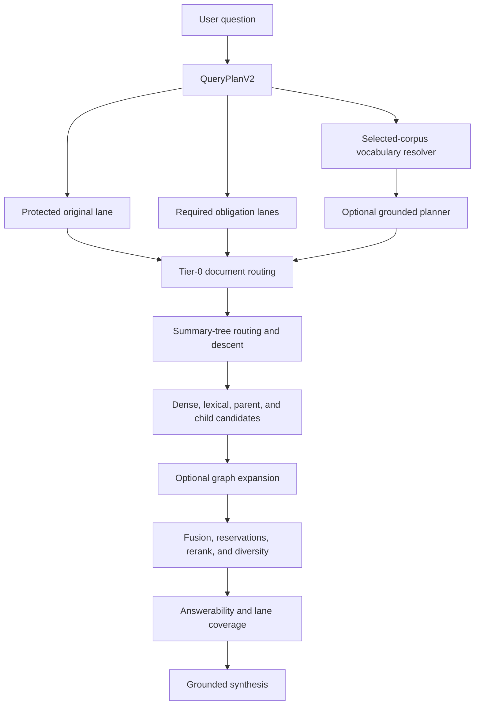

# From Fragile Pipelines to Corpus-Grounded Retrieval

## The Polymath 3.3 Engineering Journey

This document explains how Polymath 3.3 changed from a RAG application that
could ingest and retrieve information, but often stalled or returned shallow
results, into a durable corpus-grounded system with explicit readiness,
hierarchical retrieval, vocabulary translation, cross-corpus search, and
measurable quality controls.

It is written as a narrative source for NotebookLM. It can be used to create an
audio overview, an explanation video, a technical walkthrough, or a training
lesson about the architecture and the engineering decisions behind it.

No API keys, credentials, or private connection strings appear in this file.

---

## Executive Summary

The original problem was not one isolated bug. Several individually reasonable
subsystems had drifted apart:

- MongoDB knew about documents that Qdrant or Neo4j had not fully received.
- Background jobs could be duplicated, stalled, or marked differently from the
  durable artifacts they had already produced.
- Summary trees existed, but retrieval did not consistently use them as a
  document-first hierarchy.
- Query routing could identify a relevant document, but downstream fusion still
  allowed unrelated global passages to outrank it.
- Users often asked questions in ordinary language while the corpus expressed
  the answer using expert terminology.
- Cross-corpus search behaved like one large flat pool instead of preserving
  the identity and representation of each selected corpus.
- A fast route, a hybrid route, and a graph route existed, but they did not
  share a sufficiently strict planning, ranking, metadata, and evidence
  contract.

The repair had two major goals:

1. Make ingestion durable and self-reconciling so a document has one identity,
   one queue contract, and a provable readiness state.
2. Make retrieval top-down and corpus-grounded so a naive question can reach
   the right documents, summaries, concepts, chunks, and graph evidence without
   hardcoded rules for one example query.

The final result is not a claim of perfect retrieval. It is a system whose
behavior can be inspected, measured, repaired, and improved without guessing.

---

## Chapter 1: The System Before the Repair

### A pipeline that looked complete but was not strictly complete

The Corpus Manager displayed several different kinds of progress at the same
time: registered documents, parsed documents, chunks, Qdrant indexing, summary
coverage, document summaries, graph promotion, and fully enriched documents.
Those numbers were useful, but they did not always share the same denominator
or durable definition.

For example, a corpus could say 75 documents were registered while only 71 were
queryable. It could show all retrieval summaries complete while several
document-level summaries or graph promotions were still missing. A duplicate
source could also be counted as unfinished work even though it should have been
excluded from the readiness denominator.

This created a dangerous ambiguity: "queryable" was interpreted as "done."
In reality, queryable only meant that enough data existed to return something.
It did not prove that every required artifact was synchronized.

### Durable jobs and durable artifacts disagreed

The ingestion system used separate queues for source parsing, document
pipelines, extraction, summaries, and graph promotion. Over time, old retries
and repair attempts created several forms of drift:

- Duplicate job identities could appear in durable queues.
- A worker could die while a Mongo row still said the job was running.
- A successful artifact could exist even though its job row looked failed.
- An old failure could refer to a chunk that no longer existed.
- A retry could replace child vectors while accidentally threatening parent
  summaries that were already valid.
- Provider-specific failures could become permanent before every healthy
  provider family had been attempted.

The result was wasted time, repeated provider calls, confusing UI state, and a
high risk of repairing data that was already correct.

### Retrieval was too flat

Polymath already had useful components: dense vectors, lexical retrieval,
summary trees, document profiles, graph relations, reranking, and multiple
retrieval tiers. The weakness was coordination.

Routing might correctly choose a relevant document, but the final candidate
pool still allowed chunks from the entire corpus to compete on equal terms.
A short generic sentence could win because it had strong lexical overlap,
while a longer and more specific source lost because its score was diluted.

This meant routing behaved like a vote rather than a scope decision.

### Expert vocabulary was hidden from ordinary questions

The ecommerce and film corpus contains concepts such as FACS, Laban movement,
shot grammar, cinematic motion, compositing, visual hierarchy, and story
structure. A user may need those concepts without knowing their names.

A question such as "how should the actor move and look at the product?" may
need evidence from sources that use terms such as action units, effort-shape,
gaze direction, blocking, or close-up composition. Raw lexical matching cannot
bridge that gap, and one raw query embedding is not always enough.

The system needed a translation layer grounded in vocabulary that actually
exists in the selected corpus.

### The tempting but wrong shortcut

During development, it was possible to improve one test query by adding
specific patterns for a text-to-video prompt, UGC, a platform, and a product.
That produced predefined cinematography probes. It also exposed the wrong
engineering direction.

A strong RAG system should not recognize one demonstration query because the
developer encoded its nouns. It should recognize the query's intent through
general planning, corpus vocabulary, hierarchy, and evidence.

The topic-specific path was removed before the final commit. The final
production query planner contains no special rules for FACS, earrings, TikTok,
UGC, Purple Ocean, or the other evaluation examples.

---

## Chapter 2: Establishing Durable Ingestion Truth

### One stable identity per source and stage

The first repair was not an LLM improvement. It was identity.

Documents and jobs now use deterministic source and stage identities so the
system can answer these questions reliably:

- Is this the same source file as a previous attempt?
- Is this a true duplicate or a source-key collision?
- Has this exact stage already produced a valid artifact?
- Is a failed job still actionable?
- Can a retry safely reuse summaries, vectors, or graph artifacts?

Unique `job_id` indexes were enforced across all five durable queues. A backup
of the original queue state was retained before duplicate rows were reconciled.
This changed idempotency from a convention into a database-enforced contract.

### Durable queues, bounded execution, and independent lanes

The worker now treats source parsing, document processing, extraction,
summaries, and graph promotion as bounded lanes. It plans quickly, leases work
durably, and runs compatible lanes concurrently while respecting storage and
provider pressure.

This design has several important properties:

- A restart does not erase completed artifacts.
- A dead worker's leases can be reconciled without restarting unrelated work.
- New work is bounded instead of launching an unbounded backfill.
- MongoDB, Qdrant, and Neo4j pressure gates can pause new work.
- Summary and extraction calls that share one provider credential also share
  one process-wide concurrency gate.
- Provider cooldown and circuit breaking remain active when rate limits occur.

### Cross-provider recovery instead of premature failure

Extraction can use independent provider families and credentials. A chunk that
exhausts normal and rescue attempts on one family can be routed to another
healthy family that has not tried it.

The durable failure is emitted only after the available provider contract is
actually exhausted. Validation failures remain visible as audit evidence, but
they do not automatically become permanent corpus damage.

### Deterministic repair before expensive re-extraction

Many readiness gaps do not require another model call. Repair scripts were
added for:

- Corpus vocabulary backfill.
- Summary-tree index backfill.
- Tier-0 document profile reconciliation.
- Verified-document reconciliation.
- Incidental source identity repair.
- Nonsemantic source-shell repair.

This is a central cost-control lesson: use Python and database reconciliation
to repair identity, marks, counts, and projections. Use an LLM only when the
semantic artifact itself is genuinely absent or invalid.

---

## Chapter 3: Defining Strict Readiness

The readiness model was rebuilt around durable evidence rather than optimistic
stage labels.

A document is not fully enriched merely because it has chunks. Depending on
the corpus contract, strict readiness verifies:

- The source identity is valid and not an excluded duplicate.
- MongoDB contains the document and child chunks.
- Qdrant contains the required child vectors.
- Retrieval-required parent summaries are complete.
- The document summary and summary tree are synchronized.
- The summary hierarchy is indexed for routing.
- The Tier-0 document profile is indexed.
- The corpus vocabulary projection is ready.
- Extraction failures are resolved or deterministically excluded.
- Neo4j promotion is complete when graph ingestion is required.
- No blocking durable queue work remains.

Duplicates and intentionally nonsemantic files are excluded from the eligible
denominator instead of making a healthy corpus look permanently incomplete.

### Final strict-ready corpus state

At the completion of the repair:

| Corpus | Registered | Eligible and fully enriched | Retrieval summaries | Graph promoted |
|---|---:|---:|---:|---:|
| `polymath_v2` | 498 | 496/496 | 86,880/86,880 | 496/496 |
| `markbuildsbrands_transcripts` | 102 | 102/102 | 1,000/1,000 | 102/102 |
| `ecommerce_pdf` | 79 | 76/76 | 9,453/9,453 | 76/76 |

`polymath_v2` excludes two records from the strict denominator.
`ecommerce_pdf` excludes three confirmed duplicates. Informational legacy
identity audit notices remain, but they do not represent missing retrieval or
graph artifacts.

---

## Chapter 4: Building the Corpus Vocabulary Bridge

### Why a vocabulary bridge is different from query expansion

Generic query expansion asks a model to invent alternative wording. That may
increase recall, but it can also drift away from the user's question or insert
concepts that do not exist in the corpus.

The Polymath vocabulary bridge starts from the opposite direction. It creates
a versioned lexicon from corpus evidence, then lets a question discover the
closest corpus-native concepts.

Concept cards can contain:

- A canonical concept name.
- Aliases and observed source wording.
- A plain-language gloss.
- Source document and chunk identities.
- Parent and hierarchy bindings.
- Provenance and validation state.
- Dense and lexical retrieval material.

The gloss is especially important. A user may not know an expert term, but a
plain-language description of what the term does can provide a semantic
landing zone.

### Ingestion-time materialization

Vocabulary cards are materialized during ingestion and mirrored into Qdrant.
This avoids rebuilding a lexicon or re-embedding summary context on every
query. Future ingestion updates the same versioned projection rather than
creating a separate one-off index.

The large `polymath_v2` corpus ultimately contained:

- 310,024 materialized concept cards.
- 248,551 cards eligible for ANN retrieval.
- 61,473 audit-only cards retained for provenance and diagnostics.
- Exact MongoDB and Qdrant parity for the ANN-eligible projection.

### Selected-corpus global vocabulary search

Cross-corpus vocabulary lookup must not erase corpus boundaries. The final
resolver performs concurrent searches inside each selected corpus, then merges
the results into one globally ranked set.

Every result retains:

- `corpus_id`.
- A corpus-local rank.
- A global rank.
- The source and concept identities needed for hydration.

The merge also reserves representation for selected corpora. This prevents a
large corpus from completely crowding out a smaller selected corpus before
retrieval has had a chance to gather evidence from both.

---

## Chapter 5: QueryPlanV2 and Top-Down Retrieval

### The protected original query

Every query keeps a protected original lane. Decomposition, vocabulary probes,
and hierarchy routing can add recall, but they cannot delete the user's exact
wording from retrieval.

This protects the system from a common failure: a planner produces several
reasonable sub-queries, but none preserves the precise phrase that would have
matched the right source.

### Generic obligation planning

QueryPlanV2 identifies generic structure such as:

- Multiple requested outcomes.
- Comparisons and relationships.
- Enumeration versus explanation.
- Procedure requests.
- Explicit inclusion and exclusion constraints.
- Dependencies between parts of a compound question.

The deterministic planner preserves user wording. It does not insert expert
cinematography concepts or product assumptions. Corpus-native translation is
handled by the vocabulary resolver and the optional grounded planner.

### The optional grounded planner

The grounded planner is an intentionally bounded model call. It receives the
original question and vocabulary evidence retrieved from the selected corpus.
It can propose corpus-native rewrites, step-back questions, or sub-queries, but
its outputs are checked for alignment and constrained by the vocabulary that
was actually retrieved.

It also has explicit operational gates:

- An enable flag.
- A configured model.
- A durable lifetime call budget.
- A timeout.
- Cache lifetime controls.
- Minimum semantic alignment thresholds.

If these gates are not satisfied, deterministic retrieval continues without
the model call. This prevents an optional planner from becoming a hidden
availability dependency.

### Document-first routing

Retrieval now starts with document and hierarchy evidence instead of asking all
child chunks to compete immediately.

The high-level flow is:

1. Understand the question and preserve its exact wording.
2. Resolve selected-corpus vocabulary.
3. Route to relevant document profiles and summary-tree nodes.
4. Reserve evidence from strongly routed documents.
5. Descend into relevant sections, parents, and child chunks.
6. Add bounded lexical, dense, graph, and wildcard candidates.
7. Fuse, rerank, diversify, and hydrate evidence.
8. Verify required-lane and answerability coverage.
9. Send the grounded evidence package to synthesis.

### Routing is a scope prior, not a score bonus

Once upstream routing identifies a relevant document with sufficient
confidence, downstream retrieval must respect that scope. The implementation
uses document reservations and bounded wildcard evidence instead of relying on
a small score boost that global lexical noise can overcome.

This principle is recorded in `AGENTS.md` so future retrieval changes must
consider all three tiers, metadata, summary usage, schema, ranking, and corpus
representation together.

---

## Chapter 6: The Three Retrieval Tiers

Polymath retains three retrieval levels. They are not simply slow, medium, and
fast versions of the same flat search. They expose progressively richer tools.

### Tier 1: Fast

The Fast tier uses the lightest storage contract. It prioritizes Qdrant-based
retrieval and the shared planning and vocabulary layers. It is useful when the
question is focused and graph traversal is unnecessary.

### Tier 2: Hybrid

The Hybrid tier combines vector retrieval with parent hydration, lexical
signals, summary hierarchy, document routing, fusion, reranking, and diversity.
This is the primary evidence-oriented route for many questions.

### Tier 3: Graph

The Graph tier adds Neo4j facts and relation expansion to the same top-down
foundation. It is intended for relationship, mechanism, and cross-concept
questions. Graph expansion is bounded and evidence-gated so broad entities do
not automatically flood the final context.

### One contract across all tiers

All three tiers now share these invariants:

- The exact original question remains represented.
- Corpus scope and identities are preserved.
- Document-level routing occurs before final child selection.
- Vocabulary and hierarchy evidence are available.
- Required question obligations can reserve evidence.
- Metadata and source identity survive fusion.
- Final selection considers relevance, coverage, corpus/document diversity,
  and answerability.
- MCP and HTTP retrieval use the same QueryPlanV2 path.

---

## Chapter 7: Evidence, Fusion, and Synthesis

### Initial candidates and final evidence are different budgets

The initial candidate pool is intentionally broad. It exists to protect recall.
The final context is smaller because every additional chunk consumes model
context and can introduce distraction.

The final selector therefore balances:

- Relevance score.
- Required-lane coverage.
- Routed-document representation.
- Selected-corpus representation.
- Parent and child identity.
- Metadata and answer-object type.
- Redundancy and diversity.
- Graph fact support.

MMR is only one part of this decision. Diversity must not be allowed to replace
highly relevant evidence with unrelated material merely because it is
different.

### Answerability before confident synthesis

The retriever records which required lanes have evidence and which concepts are
still missing. Synthesis receives an explicit obligation checklist so it must
address each covered part of the user's request with a claim, recommendation,
step, or caveat.

This prevents a long answer from appearing complete while silently ignoring
one part of a compound question.

---

## Chapter 8: Frontend, MCP, and Operational Visibility

The backend repair would not be complete if the UI and agent interfaces still
reported old semantics.

The frontend now exposes richer readiness and retrieval diagnostics, including
corpus vocabulary state, summary-tree state, document-level enrichment, queue
state, and vocabulary routing details.

The MCP sidecar receives the same QueryPlanV2, vocabulary, hierarchy, embedder,
and reranker configuration as the HTTP backend. Live testing confirmed that a
cross-corpus MCP query returned evidence from both selected corpora and used
the selected-corpus fanout/global-merge vocabulary contract.

The final live MCP smoke test reported:

- Two selected corpora represented in final evidence.
- `selected_corpus_fanout_global_merge` vocabulary mode.
- 26 grounded vocabulary matches for the test query.

Public health checks returned HTTP 200 for the application, backend API, and
MCP endpoint after the immutable images were rebuilt.

---

## Chapter 9: Model Serving and RunPod Extraction

### Apple host embedder and reranker

The Docker application uses host-native Apple services for query embedding and
reranking:

- A 1024-dimensional Qwen3 embedding model on Apple MLX.
- Jina Reranker v3 as a warmed MPS cross-encoder.

The installer was hardened to reuse its existing environment, pull and verify
required model weights, retry launchd startup races, and verify a real inference
warmup. Health checks confirm that the reranker reports cross-encoder mode and
completed warmup shapes.

Docling remains intentionally disabled in the host runtime configuration.
Markdown, text, HTML, code, and digital PDFs use local fast paths. File types
that require the optional Docling sidecar must explicitly enable it.

### RunPod Flash extraction option

A separate RunPod Flash worker was added for high-throughput joint entity and
relation extraction using GLiNER-Relex and spaCy. It is stateless: source text
and ontology constraints are sent to the worker, while database credentials and
write access remain in the Polymath backend.

The RunPod path includes:

- Bounded windows and sentence evidence.
- Canonical ontology label mapping.
- Entity-lens batching.
- Source-backed relation evidence.
- Cached model resolution.
- Serverless scaling configuration.
- Backend integration and benchmark tooling.

This gives future ingestion another extraction option without creating a
separate data contract.

---

## Chapter 10: Validation and Evidence

The final generic build passed:

- 2,536 backend tests.
- Frontend TypeScript production build.
- Frontend lint with zero warnings allowed.
- Six RunPod Flash worker tests.
- Shell, Python, JSON, and Git whitespace checks.
- Staged-file credential scans with zero key-pattern matches.
- Live local and public health checks.
- Live authenticated MCP cross-corpus retrieval.
- Durable queue checks with zero active leases.
- Unique `job_id` index checks across all five queues.
- Corpus readiness checks for all three active corpora.

A 24-case retrieval matrix also passed during development. The final
topic-specific text-to-video rule was removed afterward, so the entire live
24-case matrix was not rerun after that simplification. Instead, the complete
unit suite and targeted deployed smoke tests were rerun.

The former text-to-video evaluation query was then tested against the final
generic deployment. No deleted special probe appeared. The query resolved 14
corpus vocabulary matches and returned directly relevant sources including:

- `retrieval-augmented-prompt-optimization-for.md`
- `a-multistage-pipeline-for-character-stable.md`
- `ontology-driven-multimodal-direction-prompting-manual.md`

The system no longer forces FACS into that query. FACS should surface only when
the corpus-grounded semantic and utility evidence supports it, not because a
developer encoded an example.

---

## Chapter 11: What Improved and What Did Not

### What improved

Before the repair:

- Readiness labels could hide missing artifacts.
- Repair queues and completed artifacts could disagree.
- Cross-corpus retrieval could lose corpus representation.
- Routing could be overruled by global lexical noise.
- Expert vocabulary had no unified corpus-scoped bridge.
- MCP and HTTP retrieval could use different planner behavior.
- Provider retries could waste calls or stop too early.
- Query-specific rules were tempting because they improved a visible example.

After the repair:

- Strict readiness is based on durable MongoDB, Qdrant, summary, lexicon, and
  Neo4j evidence.
- All five queues have unique job identities and no active duplicate work.
- Existing artifacts are preserved and reconciled before expensive retries.
- Vocabulary search is versioned, pre-indexed, corpus-scoped, and provenance
  aware.
- Retrieval is document-first and hierarchy-aware.
- The original query is protected during decomposition.
- Required obligations and corpus representation influence final evidence.
- MCP and HTTP share the same retrieval contract.
- The final production planner contains no query-topic patches.

### What remains imperfect

The reranker tradeoff is measurable. Jina improves Graph retrieval on several
quality metrics, including context precision, recall, and NDCG, but it increases
latency and underperforms the previous reranker on some Fast and Hybrid metrics.

Observed average retrieval times during one development matrix were roughly:

| Tier | Previous reranker | Jina v3 |
|---|---:|---:|
| Fast | 7.17 seconds | 10.31 seconds |
| Hybrid | 9.90 seconds | 14.43 seconds |
| Graph | 15.27 seconds | 20.13 seconds |

Full Graph answers in quality-first evaluation took roughly 69 to 79 seconds,
including retrieval and answer generation. This is acceptable for deliberate
research, but it is not a finished latency target for interactive Fast search.

The correct next step is route-specific reranker evaluation and serving
optimization, not another query regex.

---

## Chapter 12: Code Map

The most important implementation areas are:

### Corpus vocabulary and ingestion

- `backend/services/ingestion/corpus_lexicon.py`
- `backend/scripts/backfill_corpus_lexicon.py`
- `backend/services/storage/qdrant_writer.py`
- `backend/services/storage/mongo_writer.py`

### Query planning and vocabulary resolution

- `backend/services/retriever/query_plan.py`
- `backend/services/retriever/vocabulary.py`
- `backend/services/retriever/grounded_planner.py`
- `backend/services/retriever/query_semantics.py`

### Top-down routing and evidence selection

- `backend/services/retriever/tier0_router.py`
- `backend/services/retriever/summary_tree_navigator.py`
- `backend/services/retriever/planned_fusion.py`
- `backend/services/retriever/evidence_plan.py`
- `backend/services/retriever/__init__.py`

### Readiness and repair

- `backend/services/ingestion/readiness.py`
- `backend/services/ingestion/worker.py`
- `backend/services/ingestion/corpus_repair.py`
- `backend/services/ingestion/summary_tree.py`
- `backend/services/ingestion/tier0.py`

### MCP, UI, and settings

- `backend/polymath_mcp/tools.py`
- `frontend/src/components/chat/MessageBubble.tsx`
- `frontend/src/components/corpus/CorpusDetail.tsx`
- `frontend/src/components/settings/IngestionSettingsTab.tsx`

### RunPod and Apple model serving

- `backend/services/runpod_flash_extraction.py`
- `runpod_flash_extractor/app.py`
- `scripts/install_apple_mlx_runtime.sh`
- `scripts/verify_apple_mlx_runtime.py`

The complete implementation was committed to `main` in commit `010e1f3`,
titled `feat: harden corpus-grounded ingestion and retrieval`.

---

## Chapter 13: Engineering Lessons

### Lesson 1: Queryable is not complete

Readiness must be a durable contract across every required store and artifact.
Otherwise, a green label can hide missing graph, summary, or identity work.

### Lesson 2: Repair state before recomputing semantics

Many apparent ingestion failures are bookkeeping failures. Reconcile identity,
leases, marks, and indexes before spending tokens on another extraction.

### Lesson 3: Routing must constrain downstream competition

If document routing is only another score, global noise can undo it. Strong
routing needs reservations or bounded scope with a small wildcard fallback.

### Lesson 4: Preserve the user's exact question

Sub-queries can improve recall, but the original query is the final defense
against planner drift.

### Lesson 5: Ground vocabulary in the corpus

The strongest vocabulary bridge does not ask a model to guess what might exist.
It retrieves aliases, glosses, summaries, and concept bindings that are proven
to exist in the selected corpus.

### Lesson 6: Do not confuse a passing example with a general design

A query-specific rule may make one screenshot look better while making the
architecture less trustworthy. Examples belong in evaluation files. Production
logic should remain general.

### Lesson 7: Measure quality and latency separately

A reranker can improve one retrieval tier while hurting another. Production
decisions require route-specific recall, ranking, coverage, and latency data.

---

## Suggested NotebookLM Video Structure

### Segment 1: The mystery of the unfinished corpus

Open with the Corpus Manager showing documents that are queryable but not fully
enriched. Explain why several databases and asynchronous jobs can disagree even
when each service appears healthy.

### Segment 2: Establishing one durable truth

Visualize source identity, unique job IDs, bounded queues, provider retries, and
strict readiness. Emphasize deterministic reconciliation before model calls.

### Segment 3: Why retrieval felt shallow

Show a flat pool of chunks where a generic sentence outranks the correct
document. Then show document-first routing and reserved evidence.

### Segment 4: Translating ordinary language into corpus language

Introduce canonical concepts, aliases, plain-language glosses, hierarchy
bindings, and selected-corpus vocabulary search.

### Segment 5: The three retrieval tiers

Animate the shared planner feeding Fast, Hybrid, and Graph routes. Explain that
the tiers add tools and evidence, not merely delay.

### Segment 6: Rejecting the one-query patch

Tell the story of the hardcoded text-to-video path, why it seemed attractive,
and why it was removed. This is the central architectural lesson.

### Segment 7: Proof and honest limitations

Present strict-ready corpus counts, tests, MCP cross-corpus verification, and
public health. End with the reranker latency tradeoff and the principle that
remaining problems should be measured rather than hidden.

---

## Closing Perspective

The most important change in Polymath 3.3 is not one model or one search
algorithm. It is the creation of explicit contracts between ingestion,
identity, summaries, vocabulary, hierarchy, graph data, retrieval, and
synthesis.

Before this work, the application could often return an answer, but it was
difficult to prove whether the corpus was complete or why a result ranked well.
After this work, the system can explain which documents are eligible, which
artifacts exist, which vocabulary matched, which corpus contributed evidence,
which question obligations were covered, and what repair remains.

That turns Polymath from a collection of RAG components into an inspectable
knowledge system. It is still capable of improvement, especially in latency
and route-specific reranking, but future improvements now have a stable
foundation and measurable acceptance criteria.
