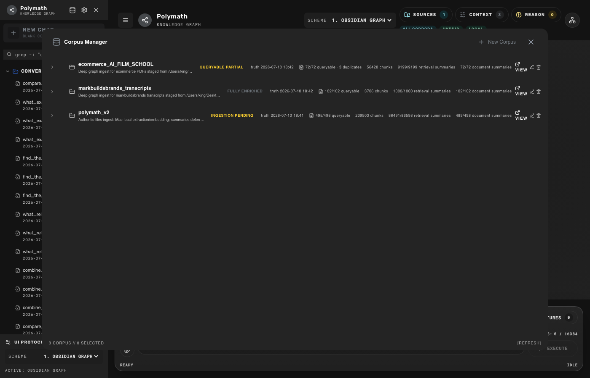
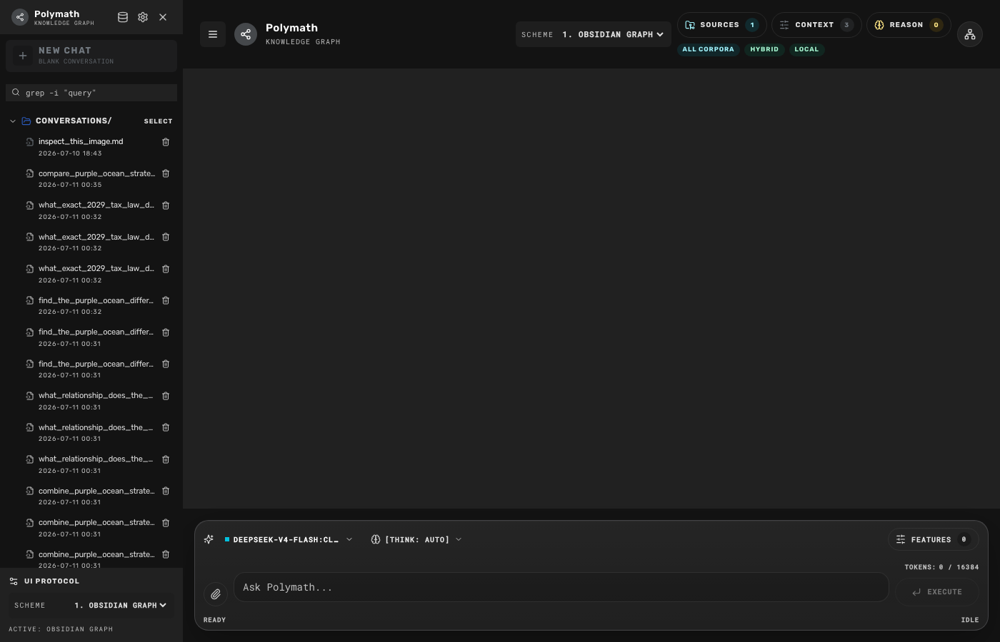
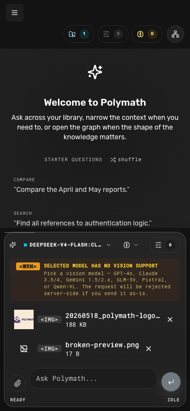

# QueryPlanV2 Retrieval Architecture

## Purpose

QueryPlanV2 replaces repeated full retrieval passes with one bounded query
plan. It is deterministic, model-free, phrase-aware, and preserves the user's
original query as both a recall lane and the final reranker query.

No corpus re-ingestion, parsing, chunking, or embedding migration is required.
The implementation reuses existing Mongo, Qdrant, and Neo4j artifacts.

## Runtime Contract

The planner emits:

- version and complexity: `simple`, `compositional`, `comparative`, or
  `dependent_multi_hop`
- atomic phrase concepts and lexical terms
- one required original-query lane
- bounded core concept lanes
- an optional bridge lane for relationship/comparison queries
- one maximum repair round

Named phrases such as `Purple Ocean strategy` and `Made to Stick principles`
remain atomic. Generic scaffolding such as `combine`, `brand`, and `offer` does
not become an independent lane.

## Route Contracts

### Fast

- Qdrant dense, sparse, summaries, and native RRF only
- no LLM planner, HyDE, graph, reranker, facet support, or evidence support
- the original query is the only runtime query

### Hybrid

- original and core QueryPlan lanes are batch-embedded once
- dense, summary, and lexical candidate branches run concurrently
- rank-only fusion reserves required lanes and selected corpora
- duplicate evidence is collapsed by document source hash plus evidence text
- at most 16 finalists are child-hydrated for one cross-encoder call
- the final reranker query is always the untouched original query

### Graph

- starts with the Hybrid candidate contract
- adds bounded fact seeds and Mode A expansion
- admits graph candidates only when provenance contains an entity, predicate,
  relation family, bridge, or evidence phrase
- caps the one reranker pass at 24 candidates

## Workload Priority

The host embedder admits work in this order:

1. `interactive_query`
2. `document_ingestion`
3. `backfill_repair`

Bulk requests release the MPS device between bounded microbatches. A newly
arrived interactive query can therefore run before the next ingestion slice.
Queue depth is exposed by `/health`.

## Cache And State Correctness

Retrieval cache keys include each corpus's durable readiness `computed_at`
epoch. Materializing readiness also clears the local assembled-result cache.
Corpus Manager requests are abortable and time-bounded, expose a retry state,
and reconcile deleted selections. Chat SSE callbacks are scoped to a request ID
and abort signal so an obsolete stream cannot mutate a newer turn.

## Attachments

Image previews use bounded dimensions and browser object URLs that are revoked
on replacement/unmount. Preview failures render visibly. Conversation history
stores metadata-only attachment receipts; binary/base64 bodies are never placed
inside Mongo chat messages.

## Feature Flags And Rollback

- `QUERY_PLAN_V2=false`: current production retrieval path
- `QUERY_PLAN_V2_SHADOW=true`: build and trace V2 without routing through it
- `QUERY_PLAN_V2=true`: use the unified V2 path

Immediate rollback:

```bash
QUERY_PLAN_V2=false docker compose \
  -f docker-compose.yml \
  -f docker-compose.apple-mlx.yml \
  -f docker-compose.offline-ingest.yml \
  up -d --no-deps backend
```

The rollback does not mutate queues or corpus artifacts.

## Acceptance Metrics

Measure under active ingestion with `scripts/retrieval_three_tier_eval.py` and
`scripts/retrieval_ecommerce_mark_queries.json`:

- Fast p95 below 2 seconds
- Hybrid p95 below 8 seconds
- Graph p95 below 10 seconds
- required concept coverage at least 90 percent
- citation precision at least 95 percent
- duplicate evidence below 5 percent

Do not promote Graph until Fast and Hybrid pass their route-specific gates.

## Live Deployment Verification

QueryPlanV2 was deployed behind `QUERY_PLAN_V2` on 2026-07-10. The local
runtime keeps `QUERY_PLAN_V2=true` and `QUERY_PLAN_V2_SHADOW=true`; repository
defaults remain off so rollback is immediate. The backend was recreated with
all three required Compose files, remained healthy, and retained the Apple MLX
endpoints:

- `EMBEDDER_URL=http://host.docker.internal:8082`
- `RERANKER_URL=http://host.docker.internal:8081`

The ingestion worker was not recreated. Its container and durable source-parse
leases remained active throughout backend rollout and evaluation.

The repository and runtime copies of the priority-aware embedder sidecar have
the same SHA-256 (`9a4ee621...`). The running host process is still the older
build and does not expose `version`, `queue_depth`, or `warmup_complete`. Its
restart is intentionally deferred until active source-parse and embedding work
drains. Retrieval deadlines protect chat in the meantime.

## Before And After

The baseline used the repeated legacy path under ingestion pressure. The final
source-only matrix used seven fixed ecommerce/transcript queries across all
three routes while source parsing and summary jobs were active.

| Route | Baseline examples | Final average | Final p95 | Final max | Gate |
|---|---:|---:|---:|---:|---:|
| Fast | 0.63-3.53s | 0.42s | 0.62s | 0.62s | <2s pass |
| Hybrid | 12.95-40.51s | 2.72s | 3.30s | 3.30s | <8s pass |
| Graph | 9.79-18.88s | 4.42s | 4.95s | 4.95s | <10s pass |

Hybrid and Graph achieved 100 percent required-concept coverage across the six
answerable cases. The unanswerable guard remained at 50 percent because the
corpora do not contain the requested fictional tax law. Parent-level duplicate
evidence was 0/92 across Hybrid and Graph. Fast achieved 66.7 percent average
required coverage on answerable cases because its contract deliberately does
not decompose complex questions or promote itself to Hybrid.

One cold/stressed comparison exhausted the reranker's remaining route budget.
The shared deadline returned fused evidence at 7.19s Hybrid and 9.19s Graph
instead of blocking or returning no sources. A later warm comparison completed
with the reranker in 5.87s Hybrid and 7.18s Graph.

## Acceptance Status

| Gate | Result | Evidence |
|---|---|---|
| Fast p95 <2s | Pass | 0.62s |
| Hybrid p95 <8s | Pass | 3.30s |
| Graph p95 <10s | Pass | 4.95s |
| Required-concept coverage >=90% | Pass for Hybrid/Graph | 100% answerable cases |
| Duplicate evidence <5% | Pass | 0/92 Hybrid/Graph sources |
| No indefinite ingestion wait | Pass | shared route deadlines and lexical/fusion fallback |
| HyDE disabled by default | Pass | presets, API defaults, and V2 planner |
| No unvalidated fallback evidence | Pass | failed branches preserve validated fused evidence only |
| Corpus Manager and image state | Pass | 3/3 live Playwright checks |
| Citation precision >=95% | Not proven | requires human-labeled answer/citation judgments |
| New host priority sidecar active | Deferred | active source-parse leases prevent a safe restart |

The 21-case matrix is a retrieval/source evaluation, not a substitute for a
human citation judgment set. Do not report the citation-precision gate as
passed until answer claims and their cited spans have been labeled.

## Frontend And Media Verification

The live Chromium suite validates terminal Corpus Manager errors, retry,
desktop image preview dimensions, metadata-only message receipts, same-file
reattachment, object URL cleanup behavior, mobile overflow, and visible invalid
image fallback. It also fails on non-2xx image responses and requires nonzero
natural image dimensions.







## Verification Commands

```bash
# Focused backend retrieval regression suite
docker run --rm -v "$PWD:/workspace" -w /workspace/backend \
  -e LITELLM_MASTER_KEY=test-master-key \
  -e AUTH_SECRET_KEY=test-auth-secret-key-32-characters-minimum \
  -e DEFAULT_ADMIN_PASSWORD=test-admin-password \
  polymath_v33-backend sh -lc \
  'python -m pytest -q $(find tests -maxdepth 1 -type f \
    \( -iname "*retriev*.py" -o -iname "*rerank*.py" \
       -o -iname "*embed*.py" -o -iname "*query_plan*.py" \
       -o -iname "*planned*.py" -o -iname "*chat_query*.py" \) -print)'

# Frontend static checks
cd frontend && npm run lint && npm run build

# Live stale-state and image checks
npx playwright test tests/e2e/stale-state-and-images.spec.ts --reporter=line
```

The committed fixed query set is
`scripts/retrieval_ecommerce_mark_queries.json`. Live JSON reports are written
to ignored `data_eval/` files so tokens, transient runtime details, and large
source payloads are not committed.
